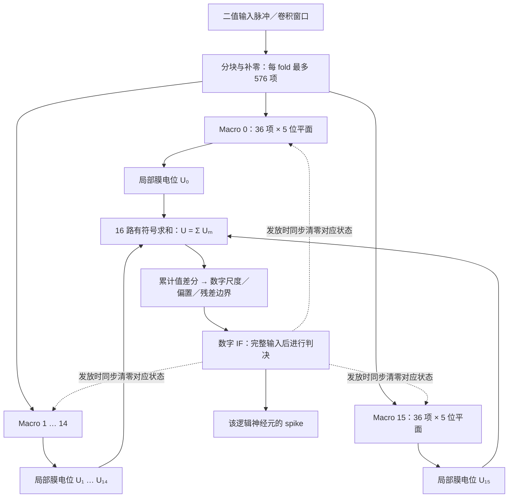
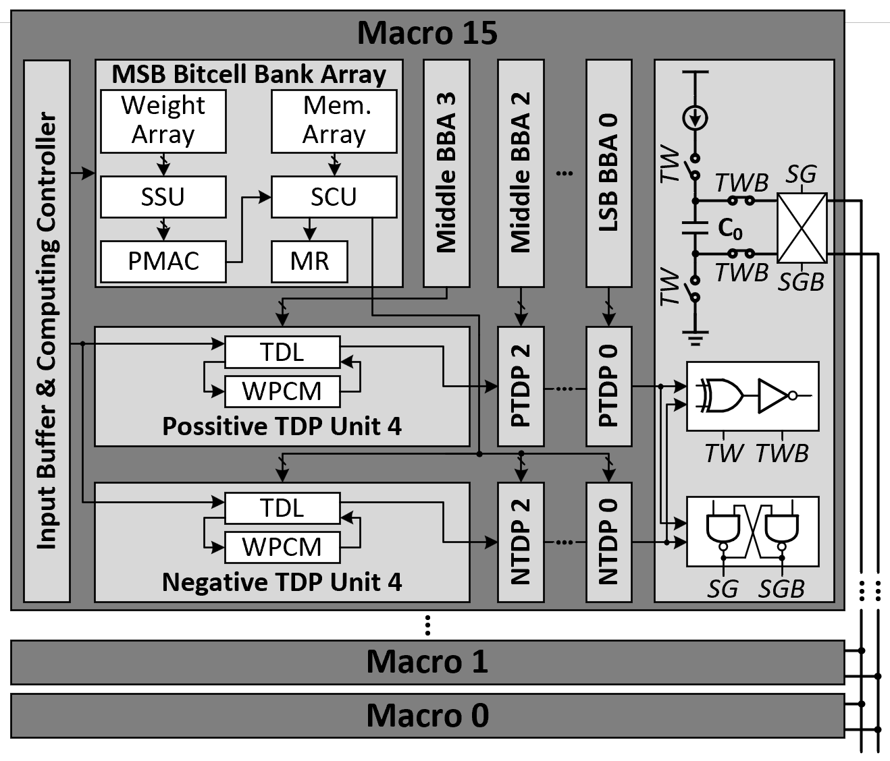

# MRAM_IMC

面向 MRAM 存内计算的 SNN 建模、推理与 MR 位宽优化工程。

当前以 Fashion-MNIST / ResNet-10 为实验对象，包含 ANN 训练、SNN 转换与微调、五位补码 Cluster 状态模型，以及 MR 钳位、转发和 Macro 间膜电位交换实验。

更新时间：2026-09-15。

> **当前结果的边界：**T64 ACC **92.19%** 是原始权重的 int5 数字参考模型在 1024 张测试样本上的结果。两种 MR 优化组合后的“整网、强制 5-bit MR、明确溢出处理”准确率尚未完成测试，不能将 92.19% 标为该实际结构的实测 ACC。模拟器件失配、噪声、物理时序和功耗也尚未由该结果验证。

## 1. 从哪里开始

- [两种 MR 优化方法与效果总结](docs/MR优化方法总结_位面钳位转发与Macro电位交换.md)：规则、守恒条件、对照结果、RAM 恢复地址交换和硬件取舍。
- [项目进度](PROGRESS.md)：按时间记录实验；较早章节是历史状态，最新结果优先看顶部。
- [五位补码结构规范](model_imc_cluster/Reference.md)：状态定义、位权、更新、复位和模型边界。
- [Cluster 推理说明](IMC_ResNet/README.md)：SCU/MR 实际整数算术与数字网络的混合推理。

部分子目录 README 和旧 PDF 保留了早期四位结构、旧推理入口或历史准确率。当前五位模型以 `model_imc_cluster/Reference.md` 及本文明确列出的实验配置为准，不直接合并不同版本的结论。

## 2. 工程目录

```text
MRAM_IMC/
├─ README.md                    项目总入口
├─ PROGRESS.md                  实验进度与历史记录
├─ ANN_ResNet10/                Fashion-MNIST ANN 训练
├─ SNN_ResNet10/                SNN 转换、阈值校准、微调与 QAT
│  ├─ models/                  网络及 MR 训练代理
│  ├─ scripts/                 训练、评估入口
│  ├─ checkpoints/             权重、阈值及训练结果
│  └─ data/                    Fashion-MNIST 数据
├─ IMC_ResNet/                  当前 Cluster 网络推理与 MR 优化实验
│  ├─ models/                  累加后端、钳位转发、状态交换
│  ├─ scripts/                 回放、统计及评估脚本
│  ├─ tests/                   算术与状态规则测试
│  └─ checkpoints/             JSON 结果、日志与实验报告
├─ model_imc_cluster/           五位结构规范与分层行为模型
├─ model_imc_cluster_simple/    简化整数参考及调试模型
├─ IMC_ResNet10/                当前为空，非运行入口
└─ docs/                       参考图、PDF 与方法总结
```

子项目说明：[ANN](ANN_ResNet10/README.md)、[SNN](SNN_ResNet10/README.md)、[完整 Cluster 模型](model_imc_cluster/README.md)、[简化模型](model_imc_cluster_simple/README.md)。

## 3. 当前使用的 Cluster 模型结构

当前整网整数推理入口采用 `ClusterConv2d + ClusterAccumulator`：将隐藏卷积的权重拆成五个补码位平面，实际计算 popcount、SCU 进位与 MR 累加，再从状态重构输出。它不是只统计脉冲数量的事件估算器。

### 3.1 Cluster → Macro → 位平面

一个 Cluster 的 **16 个 Macro 共同维护一个逻辑神经元**。每个 Macro 每轮最多处理 36 个输入项，五个位平面共享这组输入，分别由自己的权重 bit 决定是否计数。



每个 Macro 的内部数据流：

```text
                         同一组 x[0:35] 广播
             ┌──────────┬──────────┬──────────┬──────────┐
             ▼          ▼          ▼          ▼          ▼
位平面       b0         b1         b2         b3         b4
补码位权     +1         +2         +4         +8         −16
权重位       B[i,0]     B[i,1]     B[i,2]     B[i,3]     B[i,4]
             │          │          │          │          │
         x 与权重位结合，各自求和：k_b = Σ_i x_i × B[i,b]
             │          │          │          │          │
           SCU0       SCU1       SCU2       SCU3       SCU4
           4 bit      4 bit      4 bit      4 bit      4 bit
             │进位      │进位      │进位      │进位      │进位
            MR0        MR1        MR2        MR3        MR4
             └──────────┴──────────┴──────────┴──────────┘
                  按位权合成本 Macro 的局部膜电位 U_m
```

MR4 为 MSB 位平面的无符号计数器，负贡献由 −16 位权体现，不需要负输入脉冲。其余 MR 同样存储无符号计数。

| 结构项 | 当前模型 |
|---|---|
| Macro 数 | 每个逻辑 Cluster 16 个 |
| 每 Macro 单轮输入项 | 最多 36 个，不足补零 |
| 位平面数／位权 | 5 个；`(1,2,4,8,-16)` |
| SCU | 每位平面一个 4-bit 低位计数，共 80 路 |
| MR | 每位平面一个无符号高位计数，共 80 路；位宽可配置 |
| 默认构造配置 | `mr_bits=8`、`overflow='wide_reference'`；具体实验显式指定 |
| 单 fold 最大 fan-in | `16×36=576` 个输入—权重项 |
| 神经元发放 | 16 个 Macro 合成后统一判决，而非 16 个独立神经元 |
| 主实验状态行为 | 无泄漏；发放硬清零，未发放保留 |

Python 将多个样本、输出通道和空间位置并行计算，是逻辑上下文的批处理，不代表硬件上物理复制了同样数量的 Cluster。

### 3.2 状态更新、输入分块和统一复位

每个位平面一次更新为：

```text
z       = SCU + popcount
carry   = z // 16
SCU_new = z % 16
MR_new  = MR + carry

局部膜电位 U_m = Σ_b β_b × (SCU[m,b] + 16 × MR[m,b])
总膜电位   U   = Σ_m U_m
```

因为 `SCU≤15`、`popcount≤36`，carry 可以为 0～3，不能用一个布尔溢出标志代替。上述更新是原始后端规则；启用位面优化时，在候选状态更新过程中加入第 4 节的转发与抵消。

大输入扇入拆成多个 fold，连续累加到**同一组** SCU/MR，不在 fold 之间清零或重新载入旧状态：

| 3×3 卷积输入通道数 | 展开输入项 | fold 数 | 分配举例 |
|---:|---:|---:|---|
| 32 | 288 | 1 | 8 个 Macro 有效、8 个补零；当前第一层为此配置 |
| 64 | 576 | 1 | 16 个 Macro 各 36 项 |
| 128 | 1152 | 2 | 同一状态连续接收两个 fold |
| 256 | 2304 | 4 | 同一状态连续接收四个 fold |

`1×1` 卷积按自己的实际 fan-in 分块，不能直接套用上表。

```text
恢复／保留当前神经元上下文
    → fold 0 更新 → … → 最后一个 fold 更新
    → 重构累计值 → 数字 IF 判决
    ├─ 发放：清零该输出对应的全部 Macro、五个位平面的 SCU/MR
    └─ 未发放：保留状态供下个逻辑时间步使用
```

默认整网后端将状态保存在 Python 张量中，形状为 `[batch, output_channel, position, 16, 5]`；它没有模拟实际 RAM 保存／恢复周期。`MacroStateRAM` 是另行接入交换回放的功能性存储模型。

### 3.3 与 SNN 网络的连接

`make_explicit_cluster()` 将 11 个隐藏卷积（包括投影支路卷积）替换成 `ClusterConv2d`，不把连续输入的 stem 和最终 FC 分类头替换为该二值脉冲后端。

实际计算链路为：

```text
输入脉冲
 → unfold 卷积窗口、按 fold/Macro 切分
 → 五位权重门控 popcount
 → ClusterAccumulator.add_counts()：更新 SCU/MR
 → ClusterAccumulator.reduce()：有符号整数状态合成
 → 当前累计值减去 previous_total，得到本步增量
 → 恢复权重／输入尺度，加数字偏置；按网络拓扑融合残差
 → 数字 IF 积分与发放
 → fire() 清零 SCU/MR 和 previous_total
```

累计值差分用于避免数字 IF 再次累加全部历史膜电位。权重采用逐输出通道 int5 量化；物理模拟转换误差没有因为使用整数状态合成而自动纳入。

### 3.4 硬件参考结构与当前实现边界

下图为工程已有的五位 Macro/Cluster 参考图，包含 Weight/Mem Array、SSU、PMAC、SCU/MR、正负 TDP 及 TW/SG 电荷转换通路：



该图表示硬件设计意图。当前默认整网整数后端采用以下对应方式：

| 参考结构部分 | 当前 Python 实现／状态 |
|---|---|
| 输入缓冲与权重位读取 | 二值输入张量、`unfold`、预先拆分的五位权重 |
| SSU／PMAC 计数功能 | 按位权重门控并求 popcount，不模拟真实感放时序 |
| SCU／MR 状态 | `ClusterAccumulator`，真实执行整数进位、保持与复位 |
| 正负 TDP、TW/SG、电容合成的数值功能 | 默认后端通过 `reduce()` 按位权求整数和；未逐脉冲运行模拟电路 |
| 阈值判决 | 网络中的数字 IF，与状态清零钩子关联 |
| Mem Array 保存／恢复 | 默认后端驻留张量；交换实验用 `MacroStateRAM` 模拟记录访问 |

完整行为模型和波形调试工具位于 `model_imc_cluster/` 与 `model_imc_cluster_simple/`，不应假设它们的所有物理参数已自动接入 `IMC_ResNet` 整网推理。

### 3.5 默认后端与优化后端

| 模块 | 作用 | 当前接入范围 |
|---|---|---|
| [ClusterConv2d / ClusterAccumulator](IMC_ResNet/models/cluster_backend.py) | 原始五位 PMAC、SCU/MR 和状态合成 | 默认整网整数后端 |
| [IndependentCancelMR](IMC_ResNet/models/independent_cancel_mr.py) | 独立 MR＋位面转发、b0/b1/b2 抵消 | 显式实验开关，已做小样本全网对照 |
| [swap_macro_pairs](IMC_ResNet/models/macro_state_swap.py) | 同节点 Macro 间成对状态置换 | 第一层回放 |
| [MacroStateRAM](IMC_ResNet/models/macro_state_ram.py) | 将固定交换并入恢复地址选择 | 第一层功能性 RAM 回放 |

当前主线仍是**每位面一个 MR**。共享有符号 MR 是另一个历史实验配置，并未替换这里的默认结构。完整位面优化＋Macro 交换＋强制 5-bit 的组合结构尚未完成整网接入。

## 4. 当前 MR 优化结果

### 4.1 两种方法

**方法一：Macro 内位面钳位与转发。**正位等权转发结合 MSB b0/b1/b2 的等权正负抵消，保持每个 Macro 的局部膜电位不变。“钳位”是精确抵消，不是数值饱和。

**方法二：Macro 间完整膜电位交换。**在同一神经元上下文的时间步边界交换五路 MR 和五路 SCU；权重和输入固定，保持总膜电位不变。当前固定配对为 `0↔8、1↔9 … 7↔15`，优先候选是每 16 个逻辑时间步在 RAM 恢复时交换读取地址。

### 4.2 主要对照

同一原始权重、第一层 `layer1.conv1`、原分配 `8×36 有效输入＋8 个补零 Macro`、全空间、T64：

| 配置 | 最大 MR | 覆盖已观测范围所需的统一 MR 位数 | 样本范围 |
|---|---:|---:|---|
| 无位面优化、无交换 | 66 | 7 bit | 原 8 张 |
| 仅完整位面钳位与转发 | 33 | 6 bit | 原 8 张；后续扩展到 16 张仍为 33 |
| 仅每 16 步固定恢复地址交换 | 33 | 6 bit | 原 8 张 |
| 完整位面优化＋每步固定交换 | 24 | 5 bit | 原 8 张 |
| **完整位面优化＋每 16 步固定交换** | **19** | **5 bit** | **16 张** |

原诊断集为 `[0,1,2,3,4,5,64,115]`；补充集为测试索引 `128:136`。这里的 16 步不是 16 个物理时钟周期。

组合方案相对原始峰值降低约 **71.2%**，相对仅位面优化进一步降低约 **42.4%**。各位面峰值为 `[19,18,16,12,14]`。

回放使用宽整数，统计更新／抵消后、神经元清零前的最大状态。观测峰值低于 31，**不代表所有输入下强制 5-bit 都安全**。优化后整个网络的有限位宽溢出处理尚未完成。

### 4.3 RAM 交换的成本边界

功能模型将交换并入本来就发生的状态恢复：正常写回，指定边界读取配对 Macro 的状态。逐位验证结果与直接交换一致，总膜电位整数误差为 0。

在“每步全部 16 份状态都恢复／写回”的统一基准中，交换不增加逻辑状态记录的读写数量。如果原实现跳过空闲状态，或状态 RAM 仅支持本地访问，实际访问量和路由成本需要重新评估。因此目前不能宣称功耗不变或已经降低多少。

结果文件：[恢复地址交换汇总](IMC_ResNet/checkpoints/macro_ram_restore_summary.json)、[详细评估](IMC_ResNet/checkpoints/macro_ram_restore_assessment.md)。

## 5. ACC：已知结果与未完成验证

原始检查点：`SNN_ResNet10/checkpoints/hard_reset_finetuned.pt`。

Fashion-MNIST 测试索引 `[128,1152)`，共 1024 张，int5 数字参考模型：

| 时间步 | 正确数 | ACC |
|---|---:|---:|
| T16 | 741 / 1024 | **72.36%** |
| T64 | 944 / 1024 | **92.19%** |

原始记录：[shared_sweep_holdout_baseline.json](IMC_ResNet/checkpoints/shared_sweep_holdout_baseline.json)。文件名保留历史命名，该文件的评估前向是数字参考模型，并非共享 MR 硬件。

当前验证状态：

| 验证对象 | 已完成范围 | 不能据此宣称的结论 |
|---|---|---|
| 原始权重 int5 数字参考 | 1024 张 ACC | 组合硬件的实际 ACC |
| 位面钳位／转发整数后端 | 全 11 层、2 张诊断样本，预测与数字参考一致 | 大测试集准确率已验证 |
| 位面优化＋Macro 交换／RAM 恢复 | 第一层、16 张逐步整数守恒 | 全网强制 5-bit 不溢出 |
| 组合方案＋强制 5-bit＋明确溢出处理 | **未完成** | 当前已有可靠实际结构 ACC |
| 模拟失配、噪声、寄生和物理时序 | 未由上述实验验证 | 实际芯片精度、功耗或频率 |

没有不可逆溢出且采用理想计算时，精确状态变换应保持算法输出；仍需把完整组合接入整网、显式处理有限位宽，再测相同测试集上的 ACC。

### 仓库内容与本地依赖

Git 仓库包含源码、测试、结构文档及已记录的 JSON 实验结果。数据集、模型权重（`.pt/.pth/.ckpt`）、Python 缓存和运行日志通过 `.gitignore` 排除，保留在本地，不随克隆下载。需要推理或训练时，请准备数据与对应检查点；检查点路径出现在文档或结果中，不代表该二进制文件已经包含在仓库内。

## 6. 环境与运行约定

以下命令均在 **`MRAM_IMC` 根目录**执行。例如 PowerShell：

```powershell
cd D:\Projects\ai\MRAM_IMC
python -m pip install -r IMC_ResNet/requirements.txt
```

依赖主要为 PyTorch、torchvision、SpikingJelly、NumPy 和 pytest，版本约束见 [requirements.txt](IMC_ResNet/requirements.txt)。现有整数回放在 CPU 上运行，不要求 GPU。

数据应位于 `SNN_ResNet10/data/`；多数评估脚本不会自动下载。缺少数据时可执行：

```powershell
python -c "from torchvision.datasets import FashionMNIST; FashionMNIST('SNN_ResNet10/data', train=True, download=True); FashionMNIST('SNN_ResNet10/data', train=False, download=True)"
```

还需已有权重 `SNN_ResNet10/checkpoints/hard_reset_finetuned.pt` 和阈值文件 `SNN_ResNet10/checkpoints/calibrated.json`。若没有检查点，先按 ANN/SNN 子项目说明完成训练和转换；评估命令不会自动训练模型。

### 6.1 快速检查算术与状态规则

```powershell
python -m pytest -q IMC_ResNet/tests SNN_ResNet10/tests model_imc_cluster_simple/tests
```

最近一次该范围测试结果为 **78 passed**。这是当前 MR 实验相关测试集，不是对工程所有子项目测试数量的汇总；`model_imc_cluster` 的独立测试见其 README。

### 6.2 复现数字参考 ACC

```powershell
python IMC_ResNet/scripts/evaluate_shared_mr_holdout.py `
  --checkpoint SNN_ResNet10/checkpoints/hard_reset_finetuned.pt `
  --size 1024 --offset 128 `
  --output IMC_ResNet/checkpoints/repeat_digital_acc_1024.json
```

虽然脚本名含 `shared_mr`，此入口使用 int5 数字参考前向，仅用于准确率基准。

### 6.3 运行原始 Cluster 整数后端

```powershell
python IMC_ResNet/scripts/run_finetuned_cluster.py `
  --checkpoint SNN_ResNet10/checkpoints/hard_reset_finetuned.pt `
  --test-indices 64 115 --steps 16 64 `
  --mr-bits 6 --overflow wide_reference `
  --output IMC_ResNet/checkpoints/repeat_original_cluster.json
```

此命令从 SCU/MR 状态实际重构卷积结果，但默认不启用本文两种优化。`wide_reference` 保留超限数值用于观察，`--mr-bits 6` 在此模式下不是强制截断为 6 bit。

该入口还支持 `error`、`wrap`、`saturate` 溢出模式；它们是不同的数值行为，必须在结果中明确标注。仅修改此入口的 `--mr-bits 5` **不会自动启用钳位、交换或组合方案**。

### 6.4 复现固定 RAM 恢复地址交换

完整位面优化＋每 16 步固定交换，16 张样本：

```powershell
python IMC_ResNet/scripts/evaluate_macro_state_swap.py `
  --ram-restore --period 16 `
  --indices 0 1 2 3 4 5 64 115 128 129 130 131 132 133 134 135 `
  --variants baseline fixed_active fixed_all `
  --output IMC_ResNet/checkpoints/repeat_ram_swap_p16.json
```

此脚本默认保留完整位面转发和抵消，`baseline` 表示只关闭 Macro 交换。它是第一层回放，不能作为整网 ACC 测试入口。

只交换、关闭全部位面优化：

```powershell
python IMC_ResNet/scripts/evaluate_macro_state_swap.py `
  --ram-restore --period 16 --cancel-mode none `
  --variants baseline fixed_all `
  --output IMC_ResNet/checkpoints/repeat_ram_swap_only.json
```

### 6.5 单独检查位面优化的全网络整数等价性

```powershell
python IMC_ResNet/scripts/evaluate_shared_macro_mr.py `
  --independent-cancel --indices 64 115 `
  --output IMC_ResNet/checkpoints/repeat_independent_full_2.json
```

该入口在指定开关下使用五路独立 MR 抵消后端；不加该开关时属于共享有符号 MR 实验。此命令没有接入 Macro 交换，也没有完成强制 5-bit 的组合结构验证。

复现命令使用 `repeat_` 输出名，避免覆盖已引用的结果；再次运行同一命令会覆盖对应复现文件。

## 7. 主要实现与历史研究

| 文件／目录 | 用途 |
|---|---|
| `IMC_ResNet/models/cluster_backend.py` | 原始 SCU/MR 累加、卷积映射、溢出行为和统计 |
| `IMC_ResNet/models/finetuned_snn.py` | 检查点加载、融合、数字参考与 Cluster 网络构建 |
| `IMC_ResNet/models/mr_pair_cancel.py` | 位面钳位和正位等权转发 |
| `IMC_ResNet/models/independent_cancel_mr.py` | 独立 MR 抵消实验后端 |
| `IMC_ResNet/models/macro_state_swap.py` | Macro 成对状态置换 |
| `IMC_ResNet/models/macro_state_ram.py` | 状态 RAM 写回／恢复地址模型 |
| `SNN_ResNet10/models/mr_qat.py` | int5 QAT、MR 代理和训练损失 |
| `SNN_ResNet10/scripts/sweep_shared_mr_qat.py` | 多时间窗、蒸馏和 MR 约束对照；支持独立 MR 代理选项 |

共享有符号 MR、输入均摊、不同转发方向及 QAT 均有历史实验。这些配置不应与当前“每位面独立 MR”的结果混合。共享 MR 训练权重并不保证在独立 MR 结构下仍有相同收益。

## 8. 下一步需要补齐

1. 将位面钳位／转发与固定状态恢复交换共同接入整网推理后端。
2. 明确统一 5-bit 或分层位宽，以及溢出时采用报错、扩展、回退或其他实际可实现策略。
3. 在同一批 1024 张及更大测试集上，同时报告数字参考 ACC、有限结构 ACC、超限次数和逐层 MR 峰值。
4. 对状态 RAM 端口、恢复地址路由和权重／状态驻留调度建模，核算实际访问次数与周期。
5. 再评估器件失配、转换误差及面积／功耗／时序，而不以状态位数或逻辑访问数替代物理结果。
