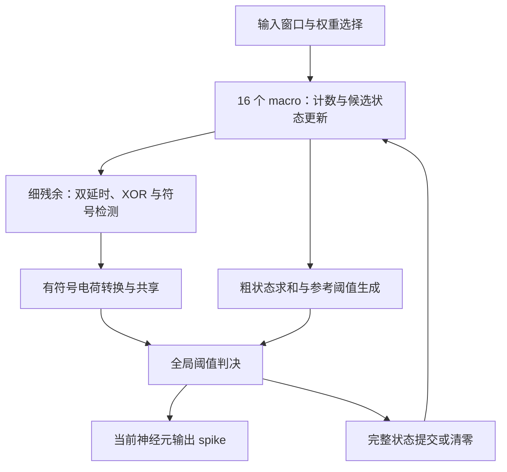

# NOTICE：CIM_MSB MRAM-IMC 结构与 SNN 三模式推理调度

更新日期：2026-09-08  
用途：统一硬件结构、网络映射、存储和调度约定，供后续架构设计、行为模型与 RTL 实现参考。  
状态：基于附件与本次讨论的设计总结；输入折叠扩展、存储组织和控制接口属于建议实现，尚不代表已完成电路或系统验证。

## 1. 依据与适用边界

本设计以以下资料为依据：

| 编号 | 资料 | 本文采用的内容 |
| --- | --- | --- |
| [A] | `MRAM_SNN_CIM_MSB双延时异或完整设计方案_局部膜电位保持与长期无发放增强版.pdf` | **具体 IMC 结构的最高优先级依据**：INT4 补码、16 个 macro、双延时/XOR、粗细状态、电荷共享与发放 |
| [B] | `三模式可重构MRAM存内计算SNN架构完整方案(2).pdf` | TM/HYB/LM 调度、时间依赖、状态管理、缓冲与模式切换 |
| [C] | `MRAM_3StateIMC.pdf` | 原始系统图中的 L1/L2、权重双 Slot、调度器、状态同步器，以及固定位置连续计算 B 步的思路 |

资料 [B]、[C] 中的“16 Macro × 4 MAC lane = 64 输出通道并行”、ADC 和差分权重配置，不直接沿用到本版计算后端。本版按资料 [A] 重新定义资源与映射。

第一阶段面向前馈 Conv/FC SNN：每个神经元依赖上一层输入和自身上一逻辑时间步状态。跨层反馈、侧向连接、残差分支或全局运算需要额外依赖分析；池化等算子需要明确的数字处理与数据格式。

## 2. 已确认的核心结论

1. **16 个 macro 共同服务一个逻辑输出神经元，最终产生 1 路 spike。**
2. 每个 macro 每次处理 36 个二值输入与对应 INT4 权重，所以一组硬件每轮覆盖 `16 × 36 = 576` 个输入—权重项。
3. 每个 macro 的四个位平面表示权重的四个二进制位，共同服务一个输出；它们不代表四个独立输出通道。
4. 积分状态已经保存在各 macro 内，全局部分完成汇总和发放判决。不能再把完整累计结果作为单步电流，交给另一个 LIF 重复积分。
5. 多个输出通道、空间位置和网络层可以分时复用同一套硬件，但必须切换正确的权重与完整状态。
6. 三模式改变执行顺序和复用粒度；同一个神经元仍按递增逻辑时间更新。
7. 神经元未发放时，其 16 份局部状态必须分别保留。全局正负抵消不能替代局部历史保存。

## 3. 统一命名与并行度

为避免不同资料中的 Macro/Cluster 命名冲突，本文作以下集成约定。`IMC Engine` 与本文的 `IMCCluster` 指同一个完整计算单元，这是本次讨论采用的层级命名。

| 名称 | 定义 |
| --- | --- |
| 位平面 | B0、B1、B2、B3，位权分别为 +1、+2、+4、-8 |
| macro | 一次处理 36 项输入贡献，具有四个位平面计数、局部状态、双延时与电荷转换通路 |
| IMC Engine / IMCCluster | 16 个 macro，加电荷共享、粗状态求和、参考生成、全局阈值判决与提交控制 |
| 逻辑神经元 | 由样本/流上下文、层、输出通道和空间位置共同确定的状态实体 |
| P | 可并行运行的完整 Engine 数量 |

| 物理资源 | 一批可并行处理的输出神经元 |
| --- | --- |
| 16 个 macro，即 P=1 | 1 个 |
| 64 个 macro，即 P=4 | 4 个 |
| 16P 个 macro | P 个 |

如果保留当前的一组 16 个 macro，默认应取 `P=1`。增加 P 是硬件复制或并行资源扩展，不是仅修改调度参数。一个计算批次包含 MRAM 读取、计数和模拟判决等阶段，不等于一个物理时钟周期。

## 4. 576 个输入项与卷积输入通道的区别

一个卷积输出神经元对应一个输出通道、一个空间位置。它所需的加权输入项数为：

$$
N_{in}=K_hK_wC_{in}.
$$

例如，`3×3` 卷积、64 个输入特征通道：

$$
N_{in}=3\times3\times64=576.
$$

可按以下方式映射：每个 macro 负责 4 个输入通道，每个通道取卷积窗口中的 9 个 spike 值，共 36 项；16 个 macro 覆盖全部 64 个输入通道。

因此：

- 对这个卷积示例，系统输入特征通道数是 **64**，神经元扇入是 **576 项**。
- 对 FC 层，576 项可以对应 576 个输入神经元。
- 从同一组 36 路输入广播到 16 个独立神经元、产生 16 路输出，是另一种组织，需要独立发放通路；本版采用 16 个 macro 汇总为一个神经元的组织。

## 5. CIM_MSB 计算与状态机制

### 5.1 INT4 权重、AND 与计数

权重采用标准四位二进制补码：

$$
w=B_0+2B_1+4B_2-8B_3,\qquad w\in[-8,7].
$$

对 macro m 的 36 个输入，逐位计算：

$$
K_{m,b}=\sum_{j=0}^{35}(x_{m,j}\land w_{m,j,b}),\qquad K_{m,b}\in[0,36].
$$

输入为 1 时计入对应权重，输入为 0 时不产生本轮新增贡献。四个位平面计数的加权组合给出本轮局部突触增量。

注意：本轮输入全零不代表历史膜电位为零。即使跳过无效权重读取，仍须按模型处理历史状态、可选泄漏与最终判决。

### 5.2 粗细两级局部膜电位

每个 macro 保存四个 6-bit 无符号细残余 A，以及一个有符号粗状态 C：

$$
U_m=A_{m,0}+2A_{m,1}+4A_{m,2}-8A_{m,3}+64C_m.
$$

细残余范围为 0～63。加入本轮计数后，细计数对 64 取模；回卷量按对应位权进入 C：

$$
\Delta C_m=o_{m,0}+2o_{m,1}+4o_{m,2}-8o_{m,3}.
$$

这里的“满 64”是位平面计数满量程，还要乘以该位的有符号位权。例如 B2 从 60 加 10 变为 70，保存 A2=6、C 增加 4，仍有 `4×70 = 4×6 + 64×4`。

新增事件首先更新候选工作状态；完成发放判决后再原子提交或清零。

### 5.3 双延时、XOR 与符号

细残余进入两条延时支路：

$$
D_{P,m}=A_{m,0}+2A_{m,1}+4A_{m,2},\qquad D_{N,m}=8A_{m,3}.
$$

两条支路由同一个参考边沿启动。在匹配与校准成立的理想模型中：

- XOR 输出脉宽正比于 `|D_P - D_N|`，表示细残余结果的大小。
- 边沿先后检测器判断符号。负支路先到、正支路后到对应正结果；反之对应负结果。
- 正、负指权重贡献符号，两条支路的实际物理延时均为非负。
- 脉宽控制积分时间，符号控制电荷方向，得到带正负号的局部电荷。

例如零历史状态下，一个有效输入乘 `-3 = 1101₂`：正支路为 5 单位延时，负支路为 8 单位，差值大小为 3，符号为负。

**稳态运行时，延时所编码的是已结合历史的细残余，不只是当前时间步的 MAC 增量。**

### 5.4 全局求和与一次发放判决

定义局部细残余 `U_RES,m = A_m,0 + 2A_m,1 + 4A_m,2 - 8A_m,3`。16 路电荷共享实现细残余求和；粗状态由数字加法树求和：

$$
R_{SUM}=\sum_{m=0}^{15}C_m,\qquad
U_{pre}=\sum_{m=0}^{15}U_{RES,m}+64R_{SUM}.
$$

通过调整比较器参考，将粗状态计入判决。在相对共模的理想电压表示下：

$$
V_{SUM}=\alpha\sum_m U_{RES,m},\qquad
V_{REF}=\alpha(\Theta-64R_{SUM}).
$$

比较 `V_SUM ≥ V_REF` 等价于比较 `U_pre ≥ Θ`。参考 CDAC 的范围、粗和位宽以及模拟校准必须满足设计要求，不能假定有限参考电路可覆盖任意粗状态。

- **未发放：**保存该神经元全部 64 个细残余和 16 个粗状态。
- **发放：**产生该神经元的 spike，并同步清零其全部局部状态。
- 清零范围仅限当前发放的逻辑神经元，不涉及其他被折叠保存的神经元。



### 5.5 长期无发放与 LIF 语义

不同 macro 可能分别持续积正数、积负数，而全局总和长期抵消。必须保留各自局部状态，并按最大静默时间配置位宽、提供高位扩展，或采用模型一致的局部泄漏/钳位。有限硬件不能无条件精确保留无限增长的历史。

基准可先采用纯 IF。资料 [A] 的可选泄漏是逐 macro 向零泄漏：

$$
U_m^{leak}=\operatorname{sign}(U_m)\max(|U_m|-\ell_m,0).
$$

它一般不等价于普通单一 LIF 的“对总膜电位统一泄漏”。局部泄漏、钳位、bias、阈值、复位与定点舍入规则，必须在训练/软件黄金模型/硬件中一致。泄漏按逻辑时间步发生，不按物理等待时间、模式块长或输入折数重复执行。

## 6. 三类折叠与固定映射

定义：

$$
F_{out}=\left\lceil C_{out}/P\right\rceil,\qquad
F_{in}=\left\lceil K_hK_wC_{in}/576\right\rceil.
$$

| 类型 | 复用方式 | 状态规则 |
| --- | --- | --- |
| 输出通道折叠 | 每批 P 个输出通道，分 F_out 批处理 | 不同输出通道拥有独立状态 |
| 空间位置复用 | 同组权重依次处理不同 y、x | 不同位置拥有独立状态 |
| 输入折叠 | 同一神经元同一时间步分 F_in 轮累加 | 中间轮只累加，全部完成后统一发放 |

设 Engine 编号为 e，输出组编号为 f_out，则：

$$
c_{out}=Pf_{out}+e,\qquad e\in[0,P-1].
$$

对展平输入，可用以下固定映射：

$$
i=576f_{in}+36m+j,\qquad m\in[0,15],\ j\in[0,35].
$$

超出有效输入范围的项补零或屏蔽；最后输出组超出 Cout 的 Engine 关闭写入。映射在同一模型上下文内必须固定，不能随着 TM/HYB/LM 切换而改变局部状态归属。

## 7. 输入超过 576 项时的建议扩展

### 7.1 推荐：固定 16 个局部分组，分轮接力累加

以 `3×3、Cin=128` 为例，输入项数为 1152，F_in=2：

| 输入轮次 | macro m 的输入通道 | 输入项数 |
| --- | --- | --- |
| 第 0 轮 | 4m～4m+3 | 36 |
| 第 1 轮 | 64+4m～67+4m | 36 |

该 macro 的同一份局部状态，归属于上述固定的 72 个输入项。一个逻辑时间步内：

1. 从当前状态形成候选状态，执行一次可选泄漏。
2. 第一轮更新四个细残余，回卷进入粗状态。
3. 第二轮继续更新同一候选状态。
4. 全部轮次完成后，启动一次双延时、电荷共享与发放判决。
5. 原子提交状态或按发放结果清零。

此方案仍保存 16 份局部历史，不需要让状态容量直接乘 F_in，但属于新增的串行输入扩展。每轮 K 仍不超过 36，每轮最多产生一次位平面回卷；一个完整时间步则可能回卷多次。

**因此必须重新核定粗状态位宽、累积增长范围以及局部泄漏模型，不能直接沿用原来“每时间步最多一次回卷”的上界。**

### 7.2 另一种语义：独立虚拟 macro

如果要求每一片 36 项都保有独立历史与独立泄漏，则需要 `16F_in` 份虚拟 macro 状态，并增加跨输入折的最终汇总机制。

它与前述“固定 16 组、每组负责多片输入”的方案不同。尤其在局部非线性泄漏/钳位下，两者不能声称无条件等价。本版建议采用 7.1，并在模型中固定其分组。

## 8. L0/L1/L2 状态与激活存储

### 8.1 状态地址和容量

逻辑地址建议为：

```text
State[context_id][layer_id][output_channel][y][x][macro_id]
    = {A0, A1, A2, A3, C}
```

P 决定物理分配，不改变逻辑状态身份。时间标签记录状态已推进到哪一步；正常推理通常只保存最新状态，不为每个时间步复制一份。并行样本/独立流、检查点或额外神经元变量需另计。

按原始格式直接保存，每个神经元所需位数为：

$$
S_{neuron}=16(4\times6+b_C).
$$

一层完整状态容量为：

$$
M_{state,layer}=H_{out}W_{out}C_{out}S_{neuron}\quad\text{bit}.
$$

若每个 Engine 的 L1 保存其负责的整层份额，规则分配时约为：

$$
M_{L1,engine}\approx H_{out}W_{out}\left\lceil C_{out}/P\right\rceil S_{neuron}.
$$

原图的 `Q×X×Y×ceil(Cout/16)` 不能直接沿用。权重的 4-bit 量化位宽，不等于一个逻辑神经元的完整状态位宽。

### 8.2 建议的存储层级

| 位置 | 内容 | 驻留周期 |
| --- | --- | --- |
| L0：Engine 工作寄存器 | 当前 P 个神经元的完整状态及候选状态 | 连续 B 个时间步 |
| L1：State Cache | 当前空间 tile 或输出通道组的状态 | 按工作集复用 |
| L2：State Memory | 各层所有逻辑神经元的最新状态 | 跨层、跨块持续保存 |
| Activation SRAM/FIFO | 带逻辑时间索引的输入及层间 spike | 至少覆盖所需时间块 |

L1 可以保存整层，也可以只保存 tile。更小的 L1 通过 L2 保证完整状态仍然存在，不能因为工作集切换而丢弃历史。

一个神经元载入后连续更新 B 步，再写回一次。即使暂未写回 L2，已提交的最新状态仍在 L0/L1；调度器必须记录所有权和 dirty 状态，不能让其他任务读取陈旧 L2 副本。

B 主要扩大 spike 缓存，不要求膜电位容量乘 B。P 改变并行度和带宽分配，不减少整层逻辑状态总量。

### 8.3 可选的局部状态压缩

资料 [A] 允许逐 macro 精确重编码。可在 L2 分别保存 16 个完整局部 U_m，回载时计算：

$$
C_m=\left\lfloor U_m/64\right\rfloor,\quad
A_{m,0}=U_m-64C_m,\quad A_{m,1}=A_{m,2}=A_{m,3}=0.
$$

这在整数模型中保持各局部膜电位，可能节省外存位数，但需证明 U 与重编码 C 的位宽，并给极值留足余量。不能只保存单个全局和，也不能同时维护两套可独立写入的权威状态。第一版建议采用原始 A/C 格式。

### 8.4 Spike 缓冲与卷积窗口

对二值 spike，单个输出时间块的原始数据量为：

$$
M_{spike,block}=BH_{out}W_{out}C_{out}\quad\text{bit}.
$$

双缓冲约乘 2；输入缓冲、标签、残差保留、空间 halo 和对齐另计。无需强制把所有卷积窗口完整展开存储，可由 Patch Generator 根据 t、y、x、输入折，从特征图缓冲抽取所需项。

## 9. 权重驻留与双 Slot

一个 Engine 的单轮有效计算权重窗口为：

$$
576\times4=2304\ \text{bit}=288\ \text{B}.
$$

这只是一个输出神经元对应的一片权重，不代表整个 MRAM 只能有这一页。卷积权重可在全部空间位置和时间步复用。

优先让权重驻留在可寻址的 MRAM 行、页或 bank 中：

```text
Weight[layer][output_channel_group][engine][input_fold][macro][bit_plane]
```

对当前输出组，最好让全部 F_in 片权重均已驻留。若容量允许，进一步驻留全部输出组与网络层；推理时只切换地址。

若每个 Slot 保存一组 P 个输出通道的全部输入折，两 Slot 的填充后权重数据量为：

$$
M_{2slot}=2P\times576F_{in}\times4\quad\text{bit}.
$$

必须区分两类 Slot：

- **SRAM 预取 Slot：**仅说明权重已到达暂存区；使用前可能仍需写入计算 MRAM。
- **MRAM 计算 bank/page：**已具备对应权重，支持通过选址进入计算。

若只驻留两组权重，跨组或跨层仍可能发生 MRAM 重编程。只有独立 bank 支持计算/编程重叠，且装载时间不超过当前组计算驻留时间，才可能隐藏装载。双缓冲本身不能保证这一点。

## 10. 三模式与统一循环

设窗口包含 T 个逻辑时间步，时间块长度为 B：

| 模式 | B | 执行特点 |
| --- | --- | --- |
| TM | 1 | 每个时间步完成全部层后推进，适合较早反馈 |
| HYB | 1 < B < T | 每层连续处理一个时间块，兼顾状态复用与输出延迟 |
| LM | T | 当前层完成全窗口后进入下一层，需全窗口层间缓冲 |

采用以下统一顺序：

```text
时间块 → 层 → 输出通道组 → 空间位置 → 时间步 → 输入折
```

例如 B=4，固定输出组和位置后，依次更新 t0、t1、t2、t3，再移动到下一个位置。对前馈 Conv/FC、神经元只有自身时间递归的情况，这一顺序合法。

必须满足：

1. 同一神经元的 t-1 更新已经完成，才能启动 t。
2. 本层所需的上一层同一 t 输入、全部相关通道和空间邻域已经就绪。
3. 存在残差时，所有参与分支均已就绪。
4. 第一次实现可采用整层时间块完成屏障，避免下层读取尚未完成的部分输出。
5. 固定权重、分组、神经元模型、量化和数值规则后，三模式以逐逻辑时间戳结果一致为目标；物理完成时间不同。

单个共享 Engine 池可以执行三种模式，但不会自动产生层间并行流水。真实 block 流水需要不同层同时占用互不冲突的物理资源。

### 10.1 主调度伪代码

下面展示固定 B 的一个窗口。连续窗口应使用全局递增的逻辑时间戳，即 `TIME_ID = window_start + t`，不能因窗口编号推进而把神经元历史重新初始化。

```text
for t0 in range(0, T, B):
    t_end = min(t0 + B, T)

    for layer in feedforward_order:
        wait_required_input_block_ready(layer, t0, t_end)

        for co0 in range(0, Cout[layer], P):
            ensure_all_input_fold_weights_ready(layer, co0)

            for y, x in output_positions(layer):
                state = load_complete_state(context, layer, co0, y, x)

                for t in range(t0, t_end):
                    work = begin_step_with_optional_leak_once(state)
                    # 若有 bias，按预先约定的局部归属每步加入一次。

                    for fin in range(Fin[layer]):
                        select_weight_page(layer, co0, fin)
                        patch = gather_spikes_with_padding(layer, t, y, x, fin)
                        K = mram_and_popcount(patch)
                        work = update_local_A_C_with_carry(work, K)
                        # 中间轮禁止发放、复位与再次泄漏。

                    fire = finalize_delay_charge_and_compare(work)
                    state = commit_or_clear_per_neuron(work, fire)
                    wait_state_update_done()
                    write_spikes(layer, t, co0, y, x, fire)

                save_complete_state(context, layer, co0, y, x, state)

        mark_layer_block_complete(layer, t0, t_end)
```

启用局部钳位时，应在模型约定的步骤执行；资料 [A] 的可选规则是在未发放时钳位并重编码，不能擅自挪到输入折之间。

### 10.2 模式切换与连续性

第一版建议只在当前 block 已完成全部网络层、状态写回和输出提交后切换，即采用 DRAIN。切换时保留有效神经元状态，更新 B、计数器与缓冲指针。

若主循环支持运行时改变 B，应将固定步长的 `for` 改成显式时间游标：本块完成后先令 `t0=t_end`，再取新 B 构建下一块，避免重算或跳过时间步。严格 LM 的完整窗口执行应从窗口边界开始。

需要中断在途计算时，再实现 CHECKPOINT_REPLAY：从所有层对应同一逻辑时间前沿的检查点恢复，并回放后续输入。不能把前层的未来状态与后层的过去状态混在一起。

强制 reset 是单独的模型/系统操作，不等同于正常切换模式。任务应带有 context、时间戳、epoch/config version 等标识，以隔离旧任务。输出聚合或监测节拍变化，也不能暗中改变神经元每步更新规则。

## 11. 原图的迁移与控制接口

| 原模块 | 本版处理 |
| --- | --- |
| SystemScheduler / WorkingCmd | 保留，采用新的循环维度、P 和 F_in |
| 每 macro 的四路 MAC/ADC/LIF | 按 [A] 改为位平面计数与局部状态通路，16 macro 统一判决 |
| 4LocalMem / Membrane | 重算容量，按逻辑神经元保存完整局部上下文 |
| Unified Memory / L2 | 按状态、spike、权重镜像划分逻辑区域 |
| Weight Slot0/1 | 明确物理介质、页容量、就绪条件和重编程代价 |
| Activation Memory64 | 输出批宽改为 P，输入端增加卷积窗口与输入折提取 |
| Memory Synchronizer | 保留，支持完整记录搬运、dirty/valid 和写回完成握手 |
| Monitor / ModeShifter | 保留，并记录局部溢出、参考范围、在途事务与逻辑时间 |

原状态机的 `STATE_READ/WRITE`、`WEIGHT_SWITCH`、`ACT_WRITE` 可以保留。将 `S_CLUSTER_RUN` 展开为：时间步开始、多轮候选累加、最终判决、状态提交四类动作。

建议接口如下，名称为设计建议：

| 控制或标签 | 含义 |
| --- | --- |
| CONTEXT_ID / LAYER_ID / NEURON_ID / TIME_ID | 标识状态归属与逻辑时间 |
| STEP_BEGIN | 开始一个神经元时间步，允许一次泄漏 |
| INPUT_FOLD_ID / INPUT_FOLD_LAST | 标识输入轮次与最后一轮 |
| INPUT_MASK / OUTPUT_VALID | 处理尾部输入与尾组输出 |
| ACCUM_ONLY | 仅更新候选 A/C，关闭最终判决与复位 |
| FINALIZE | 全部输入完成，启动最终模拟判决 |
| WEIGHT_PAGE_SELECT / WEIGHT_READY | 权重选址与计算前就绪确认 |
| STATE_LOAD / STATE_SAVE | 完整逻辑神经元状态换入、换出 |
| STATE_COMMIT / STATE_CLEAR / STATE_UPDATE_DONE | 当前神经元的原子提交、清零及完成握手 |
| STATE_WRITEBACK / STATE_INVALIDATE | 分别表示脏状态写回与明确失效 |

建议将原图的 `STATE_FLUSH` 明确命名为写回动作；发放清零、系统 reset 和缓存失效分别控制，避免“flush”同时承担多种含义。

## 12. 容量核算示例

以下是容量示例，不是吞吐或器件精度测试结果。假设 `3×3、Cin=64、Cout=64、Hout=Wout=32、B=4、P=4、bC=16`，状态采用原始 A/C 格式。

| 项目 | 计算结果 |
| --- | --- |
| 物理资源 | 4 套 Engine，共 64 个 macro |
| 每个神经元输入项 | 576 |
| 输入折数 F_in | 1 |
| 输出组数 F_out | 16，每组 4 通道 |
| 单神经元状态 | 16×(24+16)=640 bit=80 B |
| 四个当前神经元的状态 | 320 B，候选副本及控制寄存器另计 |
| 整层神经元状态 | 32×32×64×80 B=5 MiB |
| 每 Engine 平均整层状态份额 | 1.25 MiB |
| 整层 INT4 权重 | 3×3×64×64×4 bit=18 KiB |
| 四 Engine 双权重槽 | 2×4×576×4 bit=2.25 KiB |
| B=4 输出 spike 块 | 4×32×32×64 bit=32 KiB |
| 该输出块双缓冲 | 64 KiB |

以上未包含输入缓冲、检查点、ECC、对齐、标签及附加神经元变量。bC=16 仅用于算容量，实际位宽必须由动态范围确定。

这个例子说明完整局部状态可能比权重占用更大，L1 tile 缓存与 L2 容量是架构重点。若 P 从 4 改成 1，输出组数变为 64，整层状态和权重容量不变。

若改成 `Cin=128、Cout=128、P=4`，则 F_in=2、F_out=32。每个位置的一次 B=4 块需要 256 个“4 Engine 并行输入折批次”和 128 个并行发放判决批次；这些批次数不能直接当作物理时钟数。

## 13. 后续实现的关键验证点

这些是后续实现需要检查的性质，本文未声称已经完成测试：

1. 随机 INT4 权重与二值输入下，位平面结果与整数点积一致；包含负权、零输入和极值。
2. 细计数回卷、粗状态进位、逐 macro 重编码前后保持各局部 U_m。
3. 两个 macro 长期正负抵消时，各自局部历史仍可恢复，溢出可见。
4. 输入折叠与完整点积的结果一致，且每神经元每步只执行一次泄漏/偏置/发放事务。
5. 输出通道、空间位置、层与独立流切换时，状态地址不串用。
6. B=1、B=4、B=T 在相同模型和算术规则下，逐时间戳 spike 与局部状态一致。
7. 尾部通道、padding、最后不足 B 步的块正确屏蔽和推进。
8. 模式切换、状态写回与复位边界不会消费旧状态或产生旧任务输出。
9. 模拟层单独验证正负延时匹配、符号死区、电荷共享、参考范围与非理想误差。

IF、逐 macro 泄漏模型和普通全局 LIF 必须分别定义基准；不能用调度一致性掩盖模型差异。

## 14. 建议的第一版范围与待定参数

第一版建议：

- P=1，使用现有一组 16 个 macro。
- 前馈 Conv/FC + IF，先覆盖输入项不超过 576 的层，再扩展 F_in。
- 固定 16 个局部分组，输入折采用候选 A/C 接力累加。
- B=4 作为 HYB 默认值，同一调度器支持 B=1 和 B=T。
- 原始 A/C 状态格式，Engine 工作寄存器 + tile L1 + 完整 L2。
- 当前输出组全部输入折权重可寻址；明确更大范围的 MRAM 驻留容量。
- 采用整层 block 屏障和 DRAIN 模式切换。

后续再评估 P 扩展、状态压缩、层间并行、检查点回放，以及与训练一致的局部泄漏/钳位。

在确定具体网络和 RTL 参数前，需要明确：最大层维度、P、MRAM 权重页数、bC/最大静默时间、L1/L2 容量与带宽、神经元复位规则、bias/泄漏语义、非卷积算子格式。性能收益应依据这些资源和电路时序估算，不能仅由 B 或折叠次数推断。

## 15. 原始资料定位

- **[A] 第 2～6 页：**16 macro、每次 36 项输入、INT4 与四个位平面。
- **[A] 第 7～15 页：**粗细局部状态、持久化、重编码、长期无发放及可选泄漏。
- **[A] 第 15～25 页：**双延时、XOR、符号、电荷共享、动态参考及发放事务。
- **[A] 第 27～28 页：**状态动态范围和容量；第 35～37 页附近为相关接口定义。
- **[B] 第 3～6 页：**依赖条件与三模式；第 13～19 页：状态、折叠、提交和检查点。
- **[C] 第 1 页：**原始系统框图、权重 Slot、L1/L2、状态机和 B 步空间调度示意。

本文中的 P 套完整 Engine、输入折候选累加、更新后的容量公式、建议接口和最小实现范围，是在上述资料基础上形成的集成建议。
