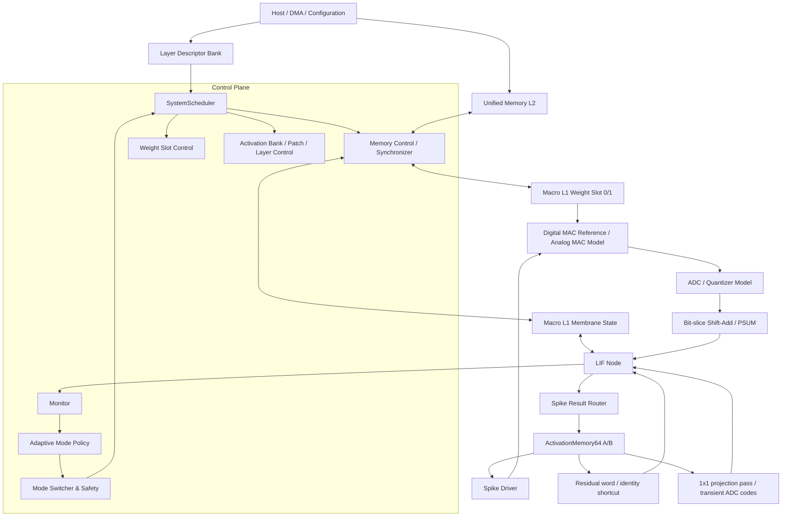

# 三模式可重构 MRAM 存内计算 SNN

> **2026-09-09 网络集成：当前工程入口已切换到 CIM_MSB 前馈网络推理。**
> 设计顶层为 `IMCCimMsbNetworkSystem`，仿真顶层为 `tb_IMCCimMsbNetwork`。
> 16 个 macro 共同维护一个神经元，采用 INT4、完整 A/C 状态和单路 spike。
> 已完成电脑端 ANN 训练→SNN 转换/INT4 导出→Vivado/XSim 三模式位精确验证。
> [网络推理说明与运行命令](docs/cim_msb_network_inference.md)；[Cluster 结构说明](docs/cim_msb_structure.md)。
> 下文的 64-lane、ADC/LIF 与 ResNet10 内容描述保留的旧系统，尚未迁移到新核心。


## 1. 项目定位

本项目面向一个 64 路并行的 SNN 存内计算结构。目标硬件使用模拟 MRAM MAC，MAC 的列电流经过 ADC 量化后进入数字累加、LIF 膜电位更新和 Spike 输出。

当前阶段只使用 Vivado/XSim 进行数字 RTL 仿真。数字 RTL 不是对真实 MRAM 阵列晶体管级行为的建模，而是对以下系统级行为的可验证替代：

- 64 路并行 MAC 任务调度；
- 权重、膜电位和激活数据的 L1/L2 搬运；
- TM/HYB/LM 三种时间块执行模式；
- ADC 量化、饱和和延迟边界；
- 1-bit identity Residual 的 LIF 前数值融合；
- 1×1 Shortcut Projection 的在线 MAC+ADC 和单次 LIF 融合；
- LIF、膜电位保存和 Spike 流；
- 监控、模式切换、Flush、Abort 和错误恢复。

本 README 描述后续重构的目标架构和构建任务。综合、布局布线、真实 MRAM 器件参数和最终频率签核不属于当前阶段。

### 1.1 当前进度快照

截至当前版本，工程已经从单 Cluster/Macro 原型推进到可装载软件权重并运行固定 Fashion-ResNet10 的统一多层系统。Vivado 工程顶层为 `IMCReconfigurableSNNSystem`，整网仿真顶层为 `tb_IMCResNet10T1System/tb_IMCResNet10T2System/tb_IMCResNet10T16System`。统一短回归入口组织了 29 组 XSim 行为测试，完整 ResNet10 使用独立长回归脚本；本阶段仍不执行综合。

| 子系统 | 当前状态 | 已验证范围 | 主要缺口 |
|---|---|---|---|
| 64 路计算阵列 | 已完成主链路第一版 | 16 Macro × 4 Cluster、64 路并行输出、Fold/坐标描述符 | 真实模拟 MRAM 阵列和物理 ADC |
| 在线 3×3 卷积 | 已完成固定 ResNet10 主链路 | PatchBuilder、Cin=16/64/128/256、Cout=64/128/256、1/2/4 Fold、stride=1/2、Residual/Projection | dilation/group/depthwise、非 64 倍数 Cout 尾部 |
| 三模式执行 | 已完成块长控制第一版 | TM `B=1`、HYB、LM `B=T` 的独立测试，统一顶层覆盖 HYB `B=4` | 多层整网运行中的模式切换压力回归 |
| Layer Descriptor | 已完成顺序层描述与自动执行 | 卷积/LIF/权重/状态、Residual Bank、独立 Projection source/shape/stride/address、当前项校验、启动快照、预取、连续 descriptor 运行 | 任意图路由和非连续跳转 |
| 权重层级 | 已完成双 Slot 第一版 | 16 Macro descriptor、后台预取、命中跳过、静止边界提交 | 多级预取队列、替换策略和真实 DMA |
| 膜电位同步 | 已完成层边界第一版 | 16 Macro State Restore/Flush，非零状态实际参与 LIF 并回写 L2 | 双状态 Bank、Checkpoint/Replay、直接膜电位统计 |
| ActivationMemory64 | 已完成 32K×64-bit 双 Bank 第一版 | 每 Bank 16K words、T=16 最大 28×28×64 tensor、消费者引用、Residual/Projection 原地写回、末尾 1K-word Patch scratch | 第三 Bank/Checkpoint 和复杂图路由 |
| ADC 数字替代 | 已完成基础模型 | 位宽、满量程裁剪、饱和、符号和固定延迟 | 噪声、非线性、bit-slice/列级 ADC 模型 |
| 安全与监督 | 已接入统一顶层第一版 | 手动模式请求、DRAIN、watchdog、Abort、发放率、安全度、报警、自适应策略接口 | 癫痫判定、L1/L2 膜电位扫描、完整自动应急闭环 |
| 网络级功能 | 已完成固定 ResNet10 端到端路径 | 9 个卷积 descriptor、Cin=1→16 补零 stem、两处 identity、两处 1×1 Projection、256→10 Spike-count/FC 分类头；T=1/T=2/T=16 逐层 Spike 和膜电位 XSim 已通过 | 任意图路由、动态网络装载协议 |

当前顺序网络支持 `layer_sequence_enable=1` 和一次 `layer_sequence_start`：控制器从指定 `(descriptor index, layer_id)` 连续执行，到 `entry_last=1` 为止。固定 ResNet10 的主链与 shortcut 生命周期已经由双 Bank、source Bank 和消费者引用计数完整表达；`layer_sequence_enable=0` 时仍保留单层 `system_start` 调试行为。任意多分支、非连续跳转和可恢复覆盖仍需要后续扩展 descriptor 路由或第三 Bank/Checkpoint。

## 2. 总体架构



系统分为四个平面：

1. **控制平面**：生成任务、管理模式、协调内存和计算边界。
2. **存储平面**：L2 保存全局权重和膜电位，Macro L1 保存当前计算所需的局部数据，ActivationMemory64 保存多时间步 Spike。
3. **计算平面**：16 个 Macro，每个 Macro 4 个 Cluster，总计 64 个 Cluster/Lane。
4. **观测与安全平面**：当前采集发放率、运行/任务状态、模式、安全度、报警和故障；膜电位统计、ADC 饱和统计和癫痫判定是下一阶段扩展项。

## 3. 计算阵列层级

### 3.1 Macro 和 Cluster

阵列组织如下：

```text
Array64
  +- Macro0 ... Macro15
       +- Cluster0 ... Cluster3
            +- MAC backend
            +- ADC/Quantizer boundary
            +- PSUM / LIF
            +- membrane register
```

每个 Cluster 对自己的权重、膜电位、累加器和 LIF 参数负责。Macro 级控制负责：

- 给 4 个 Cluster 分发同一个激活地址或 Spike 向量；
- 提供各 Lane 的权重和膜电位访问；
- 保留 Lane/channel valid 接口；当前统一在线卷积要求 `Cout` 是 64 的整数倍，输出 Fold 尾部通道屏蔽尚未接入主链路；
- 在权重 Slot 切换和状态提交时形成同步屏障。

### 3.2 数字 MAC 和模拟 MAC 的统一边界

仿真阶段使用：

```text
Digital MAC -> ADCQuantizer -> ShiftAdd -> LIF
```

真实后端使用：

```text
MRAM current accumulation -> ADC -> ShiftAdd -> LIF
```

两个后端必须共享同一个任务接口和输出接口。ADC 不能因为当前使用数字 MAC 而被省略，否则后续无法验证 ADC 位宽、饱和、延迟和 bit-slice 对齐对 SNN 结果的影响。

建议的 ADC 参数：

| 参数 | 含义 |
|---|---|
| `ADC_BITS` | ADC 输出位宽 |
| `ADC_SIGNED` | 是否使用有符号量化 |
| `ADC_FULL_SCALE` | 满量程 |
| `ADC_LATENCY` | 转换延迟 |
| `ADC_SATURATE` | 是否饱和 |
| `ADC_NOISE_ENABLE` | 是否开启非理想噪声，后续使用 |

当前 RTL 已实现 `IMCADCQuantizer`（[IMCADCQuantizer.v](MRAM_3StateIMC.srcs/sources_1/new/IMCADCQuantizer.v)）：

- 输入为有符号 `ACC_WIDTH` 位 MAC 累加码；
- `ADC_FULL_SCALE != 0` 时先按输入满量程截断；
- 当 `ADC_BITS < INPUT_WIDTH` 时采用算术右移进行代码缩放；
- `ADC_SATURATE` 控制输出码的正负饱和，`out_saturated` 标记输入或输出发生截断；
- `ADC_LATENCY=0` 为透明组合边界，`ADC_LATENCY>0` 为单事务延迟模型；
- `ADC_BYPASS=1` 可用于对照未量化的数字路径。

`IMCCluster` 默认使用 `ADC_BITS=ACC_WIDTH`、`ADC_FULL_SCALE=0`、`ADC_LATENCY=0`，所以当前集成仿真与原数字 MAC 数值兼容。后续要建模真实 ADC，只需在 Cluster 参数中降低 `ADC_BITS`、设置 `ADC_FULL_SCALE` 或增加延迟，不需要改动上层任务接口。

真实硬件若是每个 bit-slice/列单独 ADC，数字模型也应在相同粒度量化，而不是只对最终 MAC 总和量化。

### 3.3 Residual 数值契约

当前 Residual 是 1-bit identity shortcut 加一个 descriptor 可配置的有符号 16-bit `residual_scale`。每个输出任务从 ActivationMemory64 读取一个 64-bit residual word，每一 bit 对应一个 Cluster/输出通道。`cfg_residual_enable=1` 且该通道 bit 为 1 时，在 ADC 主路径之后、LIF 阈值判断之前增加 scale；bit 为 0 时增加 0：

```text
lif_value = membrane - leak + ADC(main_MAC) + bias
          + residual_spike * residual_scale
residual_spike in {0, 1}
residual_scale in signed_int16
```

`residual_scale` 默认值为 1，因而兼容原 `+1 ADC code` 语义；0 表示数值旁路，负值按二进制补码符号扩展到 Cluster 累加位宽。当前 Residual 加法本身不增加独立饱和器，仍服从现有 `ACC_WIDTH` 算术和 LIF 阈值规则。该行为不是两路 post-LIF Spike 的 OR。阵列在启动 64 个 Cluster 前先锁存完整 residual word，随后把各 bit 分发给对应 Cluster，因此 residual 源与输出为同一 Bank 时，可以先读旧字再经 Port A 原地写回新结果。

Residual 地址跟随输出逻辑地址，而不是结果流的到达序号：

```text
residual_addr = residual_physical_base
              + ((output_logical_addr - output_logical_base) >> 2)
```

这里四个连续 16-bit 输出逻辑字对应一个 64-bit Activation/Residual 物理字。identity 路径支持形状一致的 1-bit shortcut 和逐层统一 signed scale；逐通道 scale 和独立饱和/量化转换尚未实现。本项目按当前决定不构建 Q-bit shortcut tensor。

### 3.4 1×1 Shortcut Projection 契约

当 stride 或通道数变化时，shortcut 不能直接使用 identity 映射。Projection 配置在残差块的第二个 3×3 卷积 descriptor 上：主分支读取 Conv1 输出，Projection 分支独立读取该 Block 的原始输入，两路在 Conv2 的唯一一次 LIF 阈值判断前相加。

```text
Bank A: Block 原始输入
  |-- Conv1 3x3, 可带 stride -> Bank B
  `-- Projection 1x1, 独立 stride ---------+
                                              +-> Conv2 的单次 LIF -> Bank A
Bank B: Conv1 输出 -> Conv2 3x3 -------------+
```

Projection 的输入形状、步长和 source Bank 已与主 3×3 分支解耦；只有输出通道数和输出坐标必须与主分支一致：

| 上层字段 | Projection 含义 |
|---|---|
| `projection_enable` | 是否执行 numeric-only 1×1 MAC+ADC |
| `projection_source_bank` | 原始 shortcut Spike tensor 所在 Activation Bank |
| `projection_input_height/width/channels` | Projection 自己的 `Hin/Win/Cin` |
| `projection_stride` | 1×1 空间采样步长，支持 1 或 2 |
| `projection_activation_row_stride` | source tensor 相邻输入行的 64-bit physical word 步长 |
| `projection_activation_time_stride` | source tensor 相邻 timestep 的 64-bit physical word 步长 |
| `projection_weight_offset` | active Weight Slot 内 Projection 权重块起始 offset |
| 主分支 `output_channels` | 两路共享的 `Cout`，决定 `Cout/64` 个 fold |

Descriptor 模式使用对应的 `layer_desc_write_projection_*` 字段；关闭 `layer_descriptor_execute_enable` 时，Host 可通过同名 `cfg_projection_*` 接口直接配置。主分支 `Cin` 和 Projection `Cin` 分别要求为 16 的倍数，`Cout` 要求为 64 的倍数，Projection 当前最多缓存 8 个输出 fold，即 `Cout <= 512`。Projection 输出几何必须满足：

```text
projection_Hout = projection_stride == 2
                ? ceil(projection_Hin / 2) : projection_Hin
projection_Wout = projection_stride == 2
                ? ceil(projection_Win / 2) : projection_Win

projection_Hout == main_Hout
projection_Wout == main_Wout
```

```text
projection phase:
    projection_code[0:63] = ADC(1x1_projection_MAC)
    no membrane read/write, no threshold, no Spike output write

main phase:
    lif_value = membrane - leak
              + ADC(main_3x3_MAC)
              + projection_code
              + bias
    execute one LIF threshold decision
```

为避免 source Bank 与输出 Bank 相同时，Fold0 写回后污染 Fold1 的 shortcut 输入，控制器对每个 `(t,y,x)` 使用两遍式 fold 调度：

```text
for each (t, y, x):
    for projection_fold in 0 .. output_folds-1:
        numeric_only 1x1 MAC+ADC
        cache[projection_fold][0:63] = projection ADC codes

    for main_fold in 0 .. output_folds-1:
        main 3x3 MAC+ADC + cache[main_fold]
        execute exactly one LIF
        write packed Spike result
```

这个瞬时 cache 的容量为 `8 × 64 × ACC_WIDTH`，不会写入 ActivationMemory64 或 L2，因此不是 Q-bit shortcut tensor。每个新 `(t,y,x)` 都会覆盖 cache；多 timestep 按“本 timestep 全 fold preload -> 本 timestep 全 fold main -> 下一 timestep”执行。Projection 与 identity residual 在同一 descriptor 中互斥，非法组合会在 Descriptor Bank 和 Projection Scheduler 两级被拒绝。

双 Bank 原位 Projection 还有一项跨空间位置约束。HYB `B>1` 的位置优先顺序会连续处理同一 `(y,x)` 的多个 timestep，而 stride=2 Projection 的输出采用压缩布局；较晚 timestep 的输出地址可能覆盖后续 `(y,x)` 尚未读取的旧 shortcut Spike。逐位置 Fold cache 只能保护当前位置，不能保护整层后续位置。因此顶层检测到

```text
projection_enable
&& activation_route_enable
&& output_bank == projection_source_bank
```

时，将该层送入在线卷积核的 `effective_block_len` 自动设为 1。系统的 `active_mode` 和 `active_block_len` 仍保持 HYB/B=4；普通卷积和 identity residual 层继续使用 B=4，仅两个原位 Projection Conv2 层按安全的有效 B=1 顺序执行。若要求 Projection 层本身也严格保持 B=4，需要增加第三 Activation Bank，或为整层 Projection 输出增加独立暂存后再统一提交。

Projection 不再复用 PatchBuilder 的 3×3 patch 中心点，而是直接读取 `projection_source_bank` 的统一 16-bit 逻辑视图。对输出位置 `(t,y,x)`：

```text
projection_input_folds = ceil(projection_Cin / 64)
source_y = y * projection_stride
source_x = x * projection_stride

physical_offset = t * projection_activation_time_stride
                + source_y * projection_activation_row_stride
                + source_x * projection_input_folds

logical_addr = projection_bank_logical_base + 4 * physical_offset
projection_input_count = projection_Cin
```

`projection_bank_logical_base` 由 Activation Bank Controller 提供，Bank A/B 分别映射到 `0x8000/0xC000`。Projection 权重与主 3×3 权重位于同一个 active Weight Slot，descriptor 保存 `projection_weight_offset`：

```text
main_weight_words = 9 * main_Cin * ceil(Cout / 64)

projection_weight_base(fold) = active_slot_base
                             + projection_weight_offset
                             + fold * projection_Cin

projection_weight_offset >= main_weight_words
weight_word_count >= projection_weight_offset
                  + projection_Cin * ceil(Cout / 64)
```

这里每个 Cluster 仍读取自己 Bank 内的权重。权重装载器无需第二条 DMA 命令，只需把 Conv2 主权重和 Projection 权重作为同一个连续层权重块装入 inactive Slot。Descriptor 和直接 `cfg_*` 路径都会检查 Projection offset 不覆盖主 3×3 权重区，并检查整个 Projection 权重块不超过 `weight_word_count`。

## 4. 存储层级和地址规划

### 4.1 L2 Unified Memory

当前统一地址宽度为 20 bit。L2 为 `1048576 × 64-bit` 行为存储，地址单位是 64-bit word；固定 ResNet10 打包后的实际分区如下：

| 20-bit word 地址范围 | 内容 | 当前用途 |
|---|---|---|
| `0x00000-0x5D0FF` | Weight image | 9 层、16 Macro 的主分支和 Projection INT6 权重，共 381184 words |
| `0x5D100-0x5DFFF` | 对齐间隙 | 为 State 区按 `0x1000` 对齐 |
| `0x5E000-0x6ED7F` | Membrane State | 9 层独立 Restore/Flush 区，共 68992 words |
| `0x6ED80-0x7FFFF` | L2 预留 | descriptor/checkpoint/输入输出状态扩展 |
| `0x80000-0x9FFFF` | Activation 逻辑窗口 | 映射到独立 ActivationMemory64，不占用 L2 XPM |
| `0xA0000-0xFFFFF` | 系统预留 | 后续 DMA、Checkpoint 或第三 Bank |

`IMCGlobalMemoryManager` 默认仍通过 Host/DMA 端装载。完整 XSim testbench 可用参数 `L2_INIT_FILE` 直接初始化同一份 `l2_weights.mem` 以缩短仿真时间，并通过非零首尾权重回读验证装载；State 区仍经 Host 清零，再由每层 Restore/Flush 使用。

### 4.2 Macro L1 Weight

每个 Macro 有 4 个权重 Bank，每个 Bank 对应一个 Cluster/Lane。当前权重区为 `0x0000-0x3FFF`，State 区从 `0x4000` 开始。固定 ResNet10 的双 Slot 不是等分，而是按相邻 descriptor 的最大权重块规划：

```text
Slot1: base=0x0000, max=9728 words, end=0x25FF
Slot0: base=0x2600, max=4608 words, end=0x37FF
free:  0x3800-0x3FFF
```

复位时 Slot0 为 active，因此 descriptor 0 先装入 Slot1；随后偶数 descriptor 使用 Slot1，奇数 descriptor 使用 Slot0。最大块是 `b4_c2` 的 9216 个 3×3 主权重 words 加 512 个 Projection words。这里每个数字存储字段承载一个 INT6 权重；真实 bit-slice MRAM 仍需另行定义 slice、差分编码和冗余开销。

每个 Slot 必须保存描述信息：

```text
slot_valid
layer_id
output_fold_id
weight_version
source_l2_base
word_count
```

Slot 切换必须使用 `active_slot` 和 `prefetch_slot`，并通过 `weight_switch_commit` 原子提交。

### 4.3 Macro L1 Membrane

整个阵列的膜电位逻辑容量为：

```text
MembraneBits * X * Y * Cout
```

如果采用当前连续 64 通道 Fold 映射，则单个 Macro 的容量按最大值估算为：

```text
MembraneBits * X * Y * 4 * ceil(Cout / 64)
```

尾部通道通过 `lane_valid` 屏蔽。`ceil(Cout/16)` 只有在 16 个 Macro 重新均衡通道并增加映射表时才成立，不能和简单的 `fold * 64` 地址生成同时使用。

固定 ResNet10 在每个 Macro 内为 9 层分配 `0x4000-0x50D7`，共 4312 个 64-bit 状态 words；每字打包该 Macro 四个 Cluster 的 signed 16-bit 膜电位。每个状态字还带 epoch tag，用于逻辑清零；后续可增加：

- `epoch_id`，用于快速失效旧膜电位；
- `layer_id` 或状态 Bank 标识；
- 可选的 checkpoint 标识；
- 后续可扩展 ECC/错误标记。

### 4.4 ActivationMemory64

ActivationMemory64 保存：

```text
activation[timestep][y][x][output_fold][63:0]
```

当前物理深度为 `32768 × 64-bit`，分为两个 16384-word Bank：

- Bank0 逻辑基址 `0x80000`，Bank1 逻辑基址 `0x90000`；
- 每 Bank 前 15360 words 供 tensor 数据使用，可容纳 T=16 的 `28×28×64 = 12544` words；
- 末尾 1024 words 为保留区，Bank1 的 `0x9F000-0x9FFFF` 用作 3×3 Patch scratch；
- 20-bit 逻辑地址以 16-bit element 为单位，四个连续逻辑地址映射一个 64-bit 物理 word。

每个 64-bit 数据字还应配套有效信息：

```text
valid
timestep
y
x
fold_id
layer_id
epoch_id
```

外部修改输入 Spike 只允许在 ActivationScheduler 空闲、或通过明确的 Host/DMA 仲裁窗口完成。

## 5. 三模式和任务顺序

三种模式统一使用块长 `B`：

```text
TM  : B = 1
HYB : 1 < B < T
LM  : B = T
```

一个完整任务必须显式包含：

```text
(layer, output_fold, block_start, y, x, timestep_in_block)
```

建议的目标执行顺序为：

```text
for layer:
    for output_fold:
        prepare or prefetch weight slot
        for block_start in range(0, T, B):
            for y, x:
                for t_local in range(valid_block_length):
                    execute one Cluster task
```

其中：

- `valid_block_length = min(B, T - block_start)`；
- Block 首次 timestep 读取膜电位；
- Block 中间 timestep 保持 Cluster 内部膜电位；
- Block 最后 timestep 写回 L1；
- 一个输出 Spike 每个 timestep 都写入 ActivationMemory64；
- 当前层完成后才 Flush 当前层状态并进入下一层。

如果后续选择 patch-stationary，而不是上述 weight-stationary 顺序，需要同步调整 PatchBuilder 和权重换入策略，不能只修改 Scheduler 的计数器。

## 6. 状态机划分

### 6.1 SystemScheduler

当前 `IMCSystemScheduler` 不直接操作 RAM 请求，而是向 Weight Slot Controller、MemorySynchronizer 和在线卷积核发出层级命令。它已经实现的实际状态为：

```text
S_IDLE
  -> S_STATE_ISSUE -> S_STATE_WAIT       // 可选，逐 Macro Restore
  -> S_WEIGHT_ISSUE -> S_WEIGHT_WAIT     // 逐 Macro 权重命中/装载
  -> S_LAYER_ISSUE -> S_LAYER_WAIT       // 一次完整 Layer Run
  -> S_FLUSH_ISSUE -> S_FLUSH_WAIT       // 可选，逐 Macro Flush
  -> S_IDLE

任意活动阶段 --abort/flush--> S_ABORT_WAIT --> S_IDLE
```

Scheduler 在接受启动时锁存权重和状态搬运描述符，后续外部修改不会改变当前命令。Patch、Block、Fold、位置和结果反压等层内细节由 `Conv3x3PatchBuilder` 与 `TMLayerController` 管理。

### 6.2 MemorySynchronizer

只负责连续 Burst，不负责网络级决策。当前实际 FSM 只有三态，完成和错误通过 `done/error` 单周期脉冲返回：

```text
MS_IDLE
MS_PRIME
MS_STREAM
```

支持三种操作：

```text
WEIGHT_LOAD       L2 -> Macro L1 Weight Slot
STATE_RESTORE     L2 -> Macro L1 Membrane
STATE_FLUSH       Macro L1 Membrane -> L2
```

### 6.3 Activation 控制

当前还没有独立名为 `IMCActivationScheduler` 的 RTL。对应职责由三个模块共同完成：

```text
IMCActivationBankController  // A/B 元数据、容量校验和层完成提交
Conv3x3PatchBuilder          // 从 active Bank 读取 3x3 窗口并形成 patch
TMLayerController            // 消费 patch、发起 Fold 计算并输出结果描述符
```

当前采用严格的 build-patch/compute/result 分阶段访问，并通过 ready/valid 保持结果。下一阶段如要将下一位置 Patch 生成和当前位置计算重叠，应新增真正的 ActivationScheduler、队列和双 patch slot，而不是继续把仲裁逻辑堆进顶层。

## 7. 监督器和模式切换

推荐的控制关系如下：

```text
Monitor
  -> safety_score / alarms / firing_rate
  -> AdaptiveModePolicy
  -> ModeSafetyController
  -> SystemScheduler
```

`Monitor` 只观测，不直接修改计算数据。膜电位建议输出统计量，而不是每周期把全部 L1 数据复制到监督器：

```text
membrane_min
membrane_max
membrane_mean
membrane_saturation_count
spike_count
firing_rate
ADC_saturation_count
L1/L2_sync_error
```

模式切换必须经过：

```text
停止接收新任务
-> 等待 Cluster/Macro 排空
-> 处理结果和未完成 Patch
-> Flush、Checkpoint 或 epoch 失效
-> 提交新模式和 config_version
-> 恢复调度
```

当前统一顶层已经接入手动模式切换、安全控制、在线 Supervisor 和 `IMCAdaptiveModePolicy`。`adaptive_enable=0` 时策略只观测而不发请求；打开后策略在运行边界根据安全度、报警和发放率生成普通 `mode_req`，最终提交仍由安全控制器执行。现有 Supervisor 主要观测握手、任务、Spike、配置和故障信号，尚未直接扫描 L1/L2 全量膜电位；癫痫判定、自动应急处置和 Replay 仍属于后续功能。

## 8. 模块组织与当前实现

逻辑上建议按以下目录职责重组。初期不要求立即移动文件，可以先在现有扁平目录中建立相同的模块边界。

```text
rtl/
  top/
    IMCReconfigurableSNNSystem.v
  control/
    IMCSystemScheduler.v
    IMCLayerDescriptorBank.v
    IMCActivationBankController.v
    IMCWeightScheduler.v
    IMCActivationScheduler.v
  memory/
    IMCGlobalMemoryManager.v
    IMCMemorySynchronizer.v
    IMCMacro4LocalMemory.v
    IMCWeightSlotMemory.v
    IMCMembraneStateMemory.v
    ActivationBuffer64.v
  compute/
    IMCMacro16Array.v
    IMCCluster.v
    IMCCIMBackendDigital.v
    IMCADCQuantizer.v
    IMCLIF.v
  monitor/
    IMCOnlineSupervisor.v
    IMCMonitorRegisterBank.v
    IMCAdaptiveModePolicy.v
    IMCModeSafetyController.v
    IMCLayerSequenceController.v
```

当前已经建立统一顶层 `IMCReconfigurableSNNSystem`，把以下路径连接起来：

- [IMCSystemScheduler.v](MRAM_3StateIMC.srcs/sources_1/new/IMCSystemScheduler.v)：按 State Restore、16 个 Macro 权重装载、Layer Run、可选 State Flush 的顺序发出命令；
- [IMCLayerDescriptorBank.v](MRAM_3StateIMC.srcs/sources_1/new/IMCLayerDescriptorBank.v)：保存完整层运行、权重和膜电位同步 descriptor，校验当前层，并在 Layer Run 时发出下一层权重预取命令；
- [IMCLayerSequenceController.v](MRAM_3StateIMC.srcs/sources_1/new/IMCLayerSequenceController.v)：在层边界按顺序推进 descriptor index/layer id，保持启动请求直到安全控制器接受，并把预取、层执行和 abort 错误收敛为序列结束状态；
- [IMCActivationBankController.v](MRAM_3StateIMC.srcs/sources_1/new/IMCActivationBankController.v)：维护 ActivationMemory64 A/B 元数据和消费者引用计数，执行 descriptor 可编程输入/输出/residual Bank 路由、容量校验、覆盖保护及完成/Abort 生命周期提交；
- [IMCWeightSlotController.v](MRAM_3StateIMC.srcs/sources_1/new/IMCWeightSlotController.v)：维护两套 16-Macro Slot descriptor，代理前台权重请求，并把下一层预取命令展开为 16 个后台搬运命令；
- [IMCOnlineConv3x3RTLSystem.v](MRAM_3StateIMC.srcs/sources_1/new/IMCOnlineConv3x3RTLSystem.v)：Patch、卷积位置、64 路 Fold 和结果描述符；
- [IMCModeSafetyController.v](MRAM_3StateIMC.srcs/sources_1/new/IMCModeSafetyController.v)、`IMCOnlineSupervisor`、`IMCAdaptiveModePolicy`：模式、安全、监控和自适应控制；
- `UnifiedMemory`、`ActivationBuffer64` 和 Macro/L1 模型：L2、激活存储和 Cluster 计算侧的仲裁。

`MRAM_3StateIMC.xpr` 的综合/仿真顶层已切换为 `IMCReconfigurableSNNSystem`/`tb_IMCReconfigurableSNNSystem`。仍保留旧的 `IMCOnlineConv3x3RTLSystem` 测试，便于定位 Patch、LayerController 和 Array 的局部回归问题。

### 8.1 当前集成运行顺序

```text
单层：system_start
  或
序列：layer_sequence_start
  -> State Restore（可选，16 Macro 串行）
  -> Weight descriptor lookup（16 Macro 串行）
       -> 未命中：L2 -> 目标 Slot 物理搬运
       -> 已命中：跳过物理搬运
  -> Macro 15 完成且计算静止时，原子提交 active Slot
  -> Layer Run（PatchBuilder -> Cluster/Fold -> result descriptor）
       -> Layer Descriptor Bank 读取下一项
       -> 自动把下一层权重预取到 inactive Slot
       -> 从 active Activation Bank 读取，从 inactive Bank 写回
       -> Residual 使能时，每个 64 路任务启动前读取并锁存 shortcut word
       -> Projection 使能时，对同一位置先预载全部输出 Fold 的 1×1 ADC code
       -> 再逐 Fold 执行主 3×3 + cached Projection + 单次 LIF
  -> Layer 成功完成后提交 Activation A/B 角色交换
  -> State Flush（可选，16 Macro 串行）
   -> 单层：system_done
   -> 非末 descriptor：Sequence Controller 选择下一项并重复本流程
   -> 末 descriptor：sequence_done/system_done
```

模式控制器提供 `active_mode` 和 `active_block_len`：TM/HYB/LM 分别对应 `B=1`、运行时 `1<B<T`、`B=T`。集成测试已覆盖 HYB `B=4` 以及 `T=6` 时最后一个 `B=2` 尾块。Layer Run 还会生成层级 `effective_block_len`：双 Bank 原位 Projection 强制为 1，其他层直接采用 `active_block_len`。

当前 Slot0/Slot1 使用不同 L1 base。底层 `IMCMemorySynchronizer -> IMCArray64TM -> IMCMacro4LocalMemory` 已允许计算读 active Slot 的同时，向指定 Macro 的 inactive Slot 写入新权重；膜电位 Restore/Flush 仍保持独占。ModelSystem 会比较运行中的 active 权重区间与待装载区间，区间重叠时不拉高 `weight_load_ready`，Macro 内部还对意外的同地址计算读/同步写施加停顿。

`IMCWeightSlotController` 为每个 Slot 保存 16 个 Macro 的 `valid/layer/tag/L2 source/L1 destination/word count`。前台 descriptor 命中时不访问物理搬运通道；一个 next-layer 预取命令会自动展开为 inactive Slot 上的 16 个 Macro 命令。显式 `weight_switch_commit` 和 Macro 15 触发的隐式提交都会等待 `compute_busy=0`，再原子更新 `active_slot`。

`IMCLayerDescriptorBank` 现保存完整层配置：层号和末层标记，主分支输入/输出尺寸和通道数，时间步、stride、padding，Activation/Patch/Output/State 地址与步长，Residual enable/source/scale，Projection enable/source Bank/独立输入形状/stride/row stride/time stride/weight offset，LIF bias/threshold/leak/soft-reset，权重 L2/Macro stride/word count/tag，以及 State Restore/Flush、L2/L1 地址和 word count。`layer_descriptor_execute_enable=1` 时，统一顶层在每次接受单层或序列层启动的同一拍锁存当前 descriptor，后续 Restore、Weight Load、Layer Run 和 Flush 都使用同一个不可变快照；执行期间禁止改写或清空 Bank。关闭该开关时仍使用原外部 `cfg_*` 接口。

进入 Layer Run 时，Bank 校验当前 descriptor 的 index 和 layer id；非末层自动锁存下一项并保持预取请求直到下游接收，末层正常跳过。手动预取和自动预取共享 Slot Controller，手动命令优先，自动命令不会丢失。

`IMCActivationBankController` 将每个 Activation Bank 的 `valid/layer/time_steps/height/width/channels/word_count/consumer_count` 保存为元数据。`activation_route_enable=0` 时保持原 A/B Ping-Pong 兼容行为；使能后由 descriptor 指定 `input_bank/output_bank/residual_source_bank/projection_source_bank` 和输出消费者数。层启动分别校验主输入、identity residual 源和 Projection 源的元数据与消费者引用，并根据 `T*Hout*Wout*ceil(Cout/64)` 检查输出容量；正常完成后只对去重后的 source Bank 各递减一次引用，再提交输出元数据和引用数。

双 Bank 下，仍有消费者的 Bank 不允许作为普通输出覆盖。例外是 residual 或 Projection 源只剩最后一个消费者且 source 与输出 Bank 相同：identity 路径在每个任务写回前锁存旧 residual word；Projection 路径先对同一 `(t,y,x)` 的全部输出 Fold 完成 numeric-only 读取并缓存 ADC code，再开始覆盖。原位 Projection 还必须采用有效 B=1，避免压缩输出跨位置覆盖未读 source。该模式一旦开始就可能部分覆盖旧数据，因此 Abort 或 layer error 会将该 Bank 整体标为 invalid，不能恢复旧分支；需要第三 Bank 或 Checkpoint 才能提供可恢复语义。

`tb_IMCBackgroundWeightPrefetch` 已覆盖 64 输入通道计算与 64-word Slot1 装载重叠，检查 `tm_busy && weight_load_busy`、Slot0 不变、Slot1 更新、64 路输出正确，以及运行中 active Slot 覆盖命令被阻止。`tb_IMCWeightSlotController` 覆盖 descriptor、16 Macro 自动预取、前台命中跳过搬运和安全提交。`tb_IMCLayerDescriptorBank` 覆盖完整字段读回、配置校验、反压、下一层锁存、末层跳过、非法 descriptor 和清空。`tb_IMCSystemScheduler` 定向覆盖 Restore×Macro、Weight Load×Macro、Layer Run、Flush×Macro 的命令顺序和地址推进。

`tb_IMCLayerSequenceController` 覆盖两层/三层顺序完成、启动反压保持、invalid/identity/config descriptor 拒绝、非末层 index15、layer error、后台 prefetch error 和 abort。统一顶层测试进一步以一次 `layer_sequence_start` 覆盖两层 descriptor 驱动、第一层到第二层的后台权重预取、第二层 16 Macro 权重命中、descriptor 显式 Activation Bank0→Bank1→Bank0，以及每层独立 L2 状态区的 16 Macro Restore/Flush。默认场景预置非零膜电位并连续检查 48 个脉冲结果与 Flush 后 L2 数据。Residual 场景令第二层主权重和初始膜电位为零、`residual_scale=3`、阈值为 3，从 Bank1 读取主输入，从 Bank0 读取 24 个不同 shortcut word，并把结果原地写回 Bank0；逐任务结果与地址模式完全一致，同时验证 Bank0 从两个消费者递减到最后消费者后才允许覆盖。阵列定向测试另以 `scale=-1` 验证补码符号扩展。Projection 单元测试覆盖 numeric-only/main 调度、瞬时 fold cache、反压、冲突校验和 Abort；真实 64 路阵列测试覆盖 `ADC(main)=1 + ADC(projection)=4` 在阈值 5 前融合，并验证关闭 Projection 后不会复用旧值。统一顶层进一步覆盖标准两卷积下采样块：Descriptor0 执行 `28×28×64 -> 14×14×128`、stride=2 的 Conv1 并写 Bank1；Descriptor1 从 Bank1 执行 `14×14×128 -> 14×14×128` Conv2，同时从 Bank0 独立执行 `28×28×64 -> 14×14×128`、stride=2 Projection，最后一次 LIF 后原地写回 Bank0。该回归检查 784 个 result stream 项、Bank0 最终 392 words、Bank1 中间 392 words、16 Macro Slot 命中和两消费者生命周期。Descriptor1 的权重块为 `2304` 个主权重词加 `128` 个 Projection 词，Slot0/Slot1 使用 `0x0000/0x1000`，避免 2432-word 权重块互相覆盖。

### 8.2 当前统一主链路模块

下面的模块由 `IMCReconfigurableSNNSystem` 直接或间接实例化，构成当前继续开发时应优先维护的主路径。

| 模块 | 功能和用途 | 当前验证 |
|---|---|---|
| `IMCReconfigurableSNNSystem` | 统一系统顶层；选择外部配置或 Layer Descriptor，协调模式、安全、状态同步、权重 Slot、Activation A/B、Residual/Projection、在线卷积、分类头、结果流和 Supervisor | 单层/两层定向回归；固定 ResNet10 T=1/T=2 逐层 Spike、State 和分类结果 |
| `IMCLayerSequenceController` | 顺序层编排；从起始 `(index, layer_id)` 验证 descriptor，保持层启动直到接受，完成后推进到下一项或在末项结束 | 两/三层、反压、非法 descriptor、index 边界、层/预取错误和 abort |
| `IMCSystemScheduler` | 层级命令 FSM；顺序执行 Restore、16 Macro 权重检查/装载、Layer Run、Flush，并处理 Abort | 独立两 Macro 顺序测试和统一 16 Macro 测试 |
| `IMCLayerDescriptorBank` | 保存完整层配置；提供当前项合法性读口；校验 projection offset/容量/互斥；在 Layer Run 时触发下一层权重预取 | 完整字段、Projection 字段、身份/配置校验、反压、末层和错误路径 |
| `IMCWeightSlotController` | 管理 Slot0/Slot1 的 16 Macro descriptor；处理前台命中、后台预取和安全 active Slot 提交 | 双 Slot、命中、16 Macro 预取、地址冲突保护 |
| `IMCActivationBankController` | 管理双 Bank 元数据与消费者引用；支持自动 Ping-Pong 和 descriptor 可编程主输入/输出/residual/projection 源，拒绝覆盖活跃分支 | 容量、引用去重递减、多消费者保护、最后 residual/projection 原地覆盖、Abort/error |
| `IMCModeSafetyController` | 将 TM/HYB/LM 映射为块长 B；执行 DRAIN/FLUSH/CLEAR/COMMIT；处理 watchdog、紧急停止、故障锁存和版本号 | 手动切换、互锁、watchdog、故障恢复 |
| `IMCOnlineSupervisor` | 非侵入采集运行周期、任务、Spike、发放率、模式驻留、安全分数和报警 | 发放率、利用率、安全度、报警和历史计数 |
| `IMCAdaptiveModePolicy` | 根据 Supervisor 输出在运行边界建议 TM/HYB/LM；只发普通模式请求，不绕过安全控制 | 稀疏晋升、风险回退、故障互锁 |
| `IMCOnlineConv3x3RTLSystem` | 当前在线卷积核封装；仲裁 Activation、PatchBuilder、LayerController、Projection Scheduler、阵列 Host、权重和状态同步端口 | 原始 raster 到在线 3×3×64 卷积、HYB 尾块、Projection 接口 |
| `Conv3x3PatchBuilder` | 从 ActivationBuffer64 读取 `[t][y][x][fold]`，加入 padding，生成可复用的 B 时间步 3×3 patch | Patch 内容、位置顺序、边界 padding |
| `TMLayerController` | 对一个 patch 遍历 output fold；生成主权重、独立 Projection source/weight、状态、输出和 Residual 地址；Projection 时先预载全部 Fold cache，再执行全部主 Fold | Fold、位置、块首状态读、块尾状态写、时间尾块、独立 shortcut 地址和多 Fold 原地覆盖 |
| `Shortcut1x1ProjectionScheduler` | 执行 Projection numeric-only MAC+ADC，按 Fold 缓存 64 路 ADC code，再供主 3×3 的唯一一次 LIF 使用；不写 Projection tensor | preload/use-cache、反压、Abort、冲突拒绝、真实 64 路数值融合 |
| `IMCSpikeCountClassifier` | 流式累计最终 7×7×256 Spike count，执行 256×10 INT6 FC、count-domain bias、Top1/Top2 | 独立分类头回归和整网 T=1/T=2 分类对拍 |
| `IMCArray64TMModelSystem` | 把 Global L2、MemorySynchronizer 和 64 路阵列连接起来；提供专用 L1/L2 同步通道 | L2→L1→MAC 和 State Restore/Flush 链路 |
| `IMCMemorySynchronizer` | 固定延迟 burst 搬运器；支持 Weight Load、State Restore、State Flush；一次处理一个 Macro 的四 Bank 64-bit 向量 | 地址边界、缓存命中、三类搬运和连续吞吐 |
| `IMCGlobalMemoryManager` | 20-bit 行为级 L2 双口存储；Host 端装载/检查，内部端供同步器使用；可选 `.mem` 初始化只用于加速仿真 | 外部读写、Macro tile stream、整网 381184-word 权重镜像 |
| `IMCArray64TM` | 16 Macro × 4 Cluster 的 64 路阵列；支持普通 LIF 任务和无状态/无输出写的 numeric-only 任务，汇总 64 路 Spike 或 ADC code | 64 路并行、Residual、Projection numeric-only、Host/同步端口、packed activation |
| `ActivationBuffer64` | 双口 64-bit Spike 存储；一字对应一个 `[t][y][x][fold]`；提供 A/B 物理区域 | 双口访问、碰撞保护、A/B 数据流 |
| `IMCMacro4LocalTM` | 一个 Macro 的四个单 lane Cluster；广播公共激活访问、分发四个 residual bit 并连接本 Macro L1 | 四 Cluster 锁步计算、Residual 分发和公共访问 |
| `IMCMacro4LocalMemory` | 当前 Macro L1；四 Bank 权重和四 Bank 膜电位，含 epoch tag、Host/计算/同步仲裁 | 权重、状态、epoch clear 和同步向量端口 |
| `IMCStateEpochBank` | `IMCMacro4LocalMemory` 内部状态 Bank；把膜电位和 epoch tag 放在同一 BRAM 友好字中 | 快速逻辑清空和 epoch 回绕物理 scrub |
| `IMCCluster` | 最小计算节点；读取 Spike/权重、执行 MAC+ADC；普通任务融合 identity/projection 后执行 LIF，numeric-only 任务仅导出 ADC code | Abort、状态驻留、正负 Residual scale、Projection、ADC/LIF 数值和内存协议 |
| `IMCADCQuantizer` | 真实模拟 MAC 与数字 LIF 之间的行为边界；建模满量程裁剪、位宽缩放、饱和和延迟 | 正负饱和、位宽和转换延迟 |

### 8.3 已验证但未进入当前统一主链路的模块

这些模块仍有独立回归价值，但属于较早原型、专用实验封装或可选外围。新增统一系统功能时，应优先扩展 8.2 的主链路，避免形成第二套不一致实现。

| 模块 | 功能和保留用途 | 与统一主链路的关系 |
|---|---|---|
| `IMCBlockScheduler` | 通用 `(block, layer, timestep)` 任务发生器，`B=1/HYB/T` | 用于早期完整窗口三模式测试；当前统一顶层由 ModeSafetyController 提供 B，层内由在线卷积控制器调度 |
| `IMCArray64TMWindow` | 把 BlockScheduler 固定为 `B=1` 的完整 TM 窗口 | 独立 TM 顺序/状态语义回归 |
| `IMCArray64HYB` | 以可配置 B 执行块级 HYB | 独立 HYB 回归，并被旧 `IMCArray64Reconfigurable` 复用 |
| `IMCArray64LM` | 把 B 固定为 T 的严格 Layer-major 窗口 | 独立 LM 回归 |
| `IMCArray64Reconfigurable` | 早期运行时三模式、安全、Supervisor、分类监控和 GUI 寄存器集成顶层 | 功能已被统一系统部分吸收；仍用于自适应闭环/GUI 专项测试，不是 XPR 主顶层 |
| `IMCClassificationMonitor` | 统计分类 Top-1/Top-2 置信度、标签正确数和低置信告警 | `IMCSpikeCountClassifier` 已进入统一顶层；该历史统计 Monitor 尚未接到新分类头输出 |
| `IMCMonitorRegisterBank` | 提供独立只读遥测寄存器页和一致性 snapshot | 当前统一顶层直接扇出监控信号，尚未挂该寄存器页 |
| `IMCConv3x3RTLSystem` | 已连接 L2/权重装载的旧固定 3×3 RTL 系统 | 用于较小 4×4×1→2×2×64 回归 |
| `IMCOnlineConv3x3TM` | 早期在线中间层 TM 封装 | 被功能更完整的 `IMCOnlineConv3x3RTLSystem` 取代为主链路 |
| `IMCConv3x3TM`、`TMConv3x3Scheduler` | 固定层 descriptor 的 TM 卷积任务调度实验 | 验证循环次序、Cin/Fold 和地址生成 |
| `IMCMacro4WeightMover` | 经旧 Macro Host 端口逐字写四 Cluster 权重并缓存 descriptor | 主链路改用专用 64-bit `IMCMemorySynchronizer`，保留局部回归 |
| `IMCMacro4TM` | 四个各自带 UnifiedMemory 的最小 Macro 原型 | 用于早期层次验证，存储组织不是当前方案 |
| `IMCMacro4SharedTM`、`IMCMacro4SharedMemory` | 四 Cluster 共享/Banked Memory 的过渡原型 | 为当前 LocalTM/LocalMemory 设计提供过渡验证 |
| `IMCClusterMemorySubsystem`、`UnifiedMemory` | 单 Cluster 全局地址存储原型 | 用于 Cluster 内存、Abort 和 epoch clear 局部测试 |
| `ActivationPacker64` | 将 64 路结果描述符打包写入 ActivationBuffer64 | 当前 `IMCArray64TM` 已直接完成 packed write，保留流水实验 |
| `PoissonEncoder8` | 8-bit 灰度像素到可复现 Bernoulli/Poisson Spike | 面向输入 stem，尚未接入当前中间层统一顶层 |

### 8.4 文件和测试入口

当前 RTL 仍位于 Vivado 的扁平目录 `MRAM_3StateIMC.srcs/sources_1/new`，尚未物理迁移到 `rtl/control`、`rtl/memory` 等目录。`scripts/run_regression.ps1` 是统一短 XSim 入口，默认运行 29 组行为回归；ResNet10 使用 `scripts/run_resnet10_rtl_sim.tcl` 独立执行。`-FullSynthesis` 是可选旧入口，本项目当前阶段不使用。

## 9. 重构和搭建任务

### P0：冻结接口和数据契约（已完成第一版）

- [x] 定义统一任务描述符：`layer/fold/block/t/y/x/Cin/Cout/B`；
- [x] 定义 `task_valid/task_ready/task_done/task_error`；
- [x] 定义 `config_version`、`epoch_id` 和 `layer_id`；
- [x] 明确权重地址、状态地址、激活地址的逻辑映射；
- [x] 明确尾部 Fold 的 `lane_valid` 和 `channel_valid`；
- [x] 固定数字 MAC、ADC、PSUM、LIF 之间的接口。

### P1：建立统一 SystemScheduler（已完成第一版）

- [x] 新建 `IMCSystemScheduler`；
- [x] 将运行时 `B` 调度与卷积 Fold/空间坐标合并；
- [x] 由 SystemScheduler 统一发出 State/Weight/Layer/Flush 命令；
- [x] 完成 Block、Layer、Fold、Position 边界事件；
- [x] 加入 `abort`、`flush`、`done`、`error` 传播。

### P2：实现 L1 双权重 Slot（已完成第一版）

- [x] 使用不同 L1 base 建立逻辑 Slot0/Slot1；
- [x] 增加两套 16-Macro Slot descriptor 和 valid/tag；
- [x] 将一个 next-layer 命令展开为 inactive Slot 的 16 Macro 自动预取队列；
- [x] 实现 active Slot 和 inactive/prefetch Slot 的角色切换；
- [x] 只在计算静止的安全边界执行 `weight_switch_commit`；
- [x] descriptor 命中时跳过重复的物理权重搬运；
- [x] XSim 验证计算期间 Slot1 预取不会破坏 Slot0；
- [x] 运行中拒绝与 active Slot 地址区间重叠的装载命令；
- [x] State Restore/Flush 保持独占，Weight Load 可与 TM 计算并发。

### P3：完善膜电位和 ActivationMemory64

- [x] 固化 Block 首步读取、Block 中间驻留、Block 尾步写回语义，并覆盖 HYB 时间尾块；
- [x] 增加层结束 L1/L2 State Flush，并覆盖 16 Macro 数据回读；
- [x] 由每层 descriptor 配置下一层 State Restore；
- [x] 为 ActivationMemory64 增加 A/B buffer 元数据；
- [x] 完成输入 Spike 外部写入和 PatchBuilder 计算侧读取仲裁；
- [x] 使用现有 `t/y/x/fold/channel_valid` 结果描述符写入目标 Bank；
- [x] 层完成时原子交换 A/B，Abort/error 时不提交未完成输出；

### P4：加入数字 ADC 模型（已完成基础模型）

- [x] 新建 `IMCADCQuantizer`；
- [x] 支持固定延迟、位宽、饱和和符号扩展；
- [ ] 支持理想模式和可选非理想模式；
- [ ] 对照 Python/golden model 验证 MAC、ADC、LIF 数值；
- [ ] 记录 ADC 饱和、量化溢出和非法输入。

### P5：接入 Monitor 和模式切换（已完成控制闭环第一版）

- [x] 将 Supervisor 连接到 Scheduler、任务、结果和安全控制事件；
- [x] 支持手动切换 TM/HYB/LM；
- [x] 验证 DRAIN、逻辑 Flush、epoch/config version、watchdog 和故障恢复；
- [x] `adaptive_enable=0` 时策略不发起模式请求；
- [x] 接入 AdaptiveModePolicy，并统一经过 ModeSafetyController 提交；
- [ ] 将 L1/L2 膜电位 min/max/mean/saturation 统计接入 Supervisor；
- [ ] 增加癫痫判定、自动处置和状态 Replay 闭环。

### P6：网络级功能

- [x] Layer Descriptor Bank 保存权重预取字段并自动发起下一层预取；
- [x] 将卷积尺寸、LIF、状态同步地址和 Activation 路由字段扩展到 Layer Descriptor Bank；
- [x] 增加 descriptor 执行开关、当前项校验和启动时原子配置快照；
- [x] 层间 Activation Ping-Pong 第一版：顺序层 A→B→A 自动路由；
- [x] 增加 Layer Sequence Controller，自动推进连续 descriptor index/layer id 并连续启动多层；
- [x] 扩展 Activation/Residual descriptor：可编程 `input_bank/output_bank/residual_source_bank/residual_scale/output_consumer_count`；
- [x] 增加双 Bank 消费者引用计数、活跃输出覆盖保护和最后 residual 消费者原地覆盖规则；
- [x] Residual Adder：64 路 1-bit identity shortcut 在 ADC 后、LIF 阈值前乘 descriptor signed 16-bit scale 后累加，默认 scale=1；
- [x] 覆盖 `scale=3` 的 descriptor 端到端执行和 `scale=-1` 的阵列补码符号扩展；
- [x] Descriptor 驱动的两层 Residual 集成回归：最后消费者从 Bank0 读取并原地写回 Bank0；
- [x] 1×1 Shortcut Projection Scheduler：从独立 Activation source Bank 执行 numeric-only MAC+ADC，再在主分支唯一一次 LIF 前融合；
- [x] Projection descriptor：独立 `source_bank/Hin/Win/Cin/stride/row_stride/time_stride/weight_offset`、权重容量、输出几何和 identity 互斥校验；
- [x] 多 Fold 两遍式调度：同一 `(t,y,x)` 先预载全部 Projection Fold ADC code，再执行全部主 Fold，修复同 Bank 原地覆盖污染；
- [x] Projection source Bank 独立消费者引用、元数据校验、去重递减和 Abort/error 失效；
- [x] 双 Bank 原位 Projection 的层级安全调度：HYB/LM 下自动使用有效 B=1，避免压缩输出覆盖后续位置尚未读取的 shortcut Spike；
- [x] Projection 定向回归：调度反压/Abort/冲突、瞬时 fold cache，以及真实 64 路 `ADC(main)+ADC(projection)` 数值融合；
- [x] Descriptor 驱动的真实两卷积 `b2` 下采样残差块：Conv1 `28×28×64 -> 14×14×128`，Conv2 `14×14×128 -> 14×14×128`，Projection 独立从原始 `28×28×64` Bank 以 stride=2 采样，检查 784 个流结果和两个 Bank 各 392 words；
- [x] 统一地址扩展为 20 bit：L2 `1M×64-bit`、Activation `32K×64-bit`、每 Bank 16K words；
- [x] 固定 ResNet10 离线 packer：生成 L2 权重、9 条 descriptor、输入 Spike、分类头、逐层 Spike 和 L2 State golden；
- [x] Cin=1 stem 使用 Cin=16 补零映射，bit/channel 0 承载灰度输入，其余输入和权重为零；
- [x] 256→10 流式 Spike-count/FC 分类头，并输出 Top1/Top2；
- [x] 整网 T=1/T=2/T=16 XSim：一次 `layer_sequence_start` 完成 9 层，逐层检查 4312×T 个 Spike words、68992 个 State words 和分类结果；
- [ ] Checkpoint/Replay、Input Replay 和双状态 Bank；
- [x] 完成固定 ResNet10 的 T=16 HYB/B=4 十样本长回归：样本 0-9 均逐层匹配 Python golden，分类为 `9/2/1/1/6/1/4/6/5/7`；
- [ ] 完成任意 ResNet 计算图路由。

### P6.1：固定 ResNet10 实现状态

当前网络是 Fashion-ResNet10-NoBN：9 个 3×3 主路径卷积加一个分类头。下采样 Projection 挂在 `b2_c2/b4_c2`，从 Block 原始输入读取；`b2_c1/b4_c1` 只执行 stride=2 主分支 Conv1。

Python 软件基线位于 `software/fashion_resnet12_snn.py` 和 `artifacts/fashion_resnet10_snn/`。10K Fashion-MNIST 测试集结果为：ANN float 92.19%、ANN INT6 91.91%、SNN INT6 T=16 88.40%、T=32 89.76%。RTL package 使用 T=16 导出的 INT6 权重、阈值、bias 和分类头。

| 项目 | 当前实现 | 验证状态 |
|---|---|---|
| 9 层顺序控制 | packed descriptor 表、自动预取、双 Slot、State Restore/Flush | T=1/T=2/T=16 均完成 9 层 |
| `b2/b4` Projection | Conv2 descriptor 携带独立 source shape/stride/weight offset；双 Bank 原位执行时自动使用有效 B=1 | 两个下采样 Block 逐层 Spike 对拍通过 |
| Weight Slot | Slot1 `0x0000/9728`，Slot0 `0x2600/4608` | 最大 `b4_c2+Projection` 无重叠运行通过 |
| Activation | 两个 16K-word Bank，Bank1 末尾 1K Patch scratch | T=16 容量检查通过；T=1/T=2 生命周期通过 |
| Stem | Cin=1 数学张量映射到 Cin=16，未用通道补零 | 首层逐 Spike/State 对拍通过 |
| 软件包 | `pack_resnet10_rtl.py` 从 INT6 NPZ/manifest 生成全部 `.mem` 和 JSON | T=1/T=2/T=16 数据包均生成 |
| 分类头 | 7×7×256 Spike count、256×10 INT6 FC、bias、Top1/Top2 | 独立回归和 T=1/T=2/T=16 整网通过 |
| 整网 testbench | 逐层 Spike、最终 L2 State、Bank/Slot/descriptor 和分类检查 | T=1、T=2、T=16 全部通过；T=16 HYB/B=4 十样本通过 |

### P6.2：T=16 HYB/B=4 十样本实测

2026-08-09 至 2026-08-10 使用 Vivado 2025.1 XSim、`--debug off --O3`，将样本 0-9 分为两批，每批为五个样本各启动一个私有 XSim 进程并行运行。系统 active 配置为 HYB/B=4；普通层按 B=4 执行，`b2_c2/b4_c2` 的双 Bank 原位 Projection 自动使用有效 B=1。每个样本均完成 9 层，逐项检查 68,992 个 Spike result words、68,992 个最终 L2 membrane words、预测 class、Top1 score 和 Top2 score。

| 样本 | 标签 | RTL class | RTL score | XSim elapsed | Kernel CPU | 结果 |
|---:|---:|---:|---:|---:|---:|---|
| 0 | 9 | 9 | 906 | `02:33:38` | `9080.186 s` | PASS |
| 1 | 2 | 2 | 1262 | `02:45:51` | `9798.780 s` | PASS |
| 2 | 1 | 1 | 1000 | `02:37:28` | `9308.483 s` | PASS |
| 3 | 1 | 1 | 765 | `02:35:50` | `9211.406 s` | PASS |
| 4 | 6 | 6 | 545 | `02:44:01` | `9682.983 s` | PASS |
| 5 | 1 | 1 | 710 | `02:31:05` | `8965.968 s` | PASS |
| 6 | 4 | 4 | 243 | `02:30:58` | `8958.828 s` | PASS |
| 7 | 6 | 6 | 939 | `02:33:42` | `9121.421 s` | PASS |
| 8 | 5 | 5 | 1005 | `02:26:33` | `8697.062 s` | PASS |
| 9 | 7 | 7 | 1504 | `02:26:56` | `8721.624 s` | PASS |

样本 0-4 批次墙钟约 `02:46:41`，样本 5-9 批次墙钟为 `02:34:58`。新增批次 ACC 为 `100% (5/5)`，累计 RTL 小样本 ACC 为 `100% (10/10)`；十个 RTL class/score 与各自 Python golden 完全一致，十份 package 的权重 SHA-256 相同。这里的 `10/10` 只表示十个固定样本的 RTL 端到端回归结果，不是完整测试集精度估计，也不能替代 10K Fashion-MNIST 上的软件 SNN INT6 T=16 准确率 `88.40%`。

任意图路由、第三 Activation Bank、Checkpoint/Replay、膜电位遥测和 ADC 非理想模型不是固定 ResNet10 无故障整网推理的前置条件，继续作为通用性、恢复能力和硬件逼真度扩展。

### P7：下一阶段建议顺序

1. 固定 ResNet10 T=16 通过后，把完整长回归结果冻结为基线。
2. 增加 descriptor `next_index/next_layer_id`，支持非连续层和更一般的残差图。
3. 增加第三 Activation Bank 或 Checkpoint，给原地覆盖提供可恢复 Abort 语义。
4. 将膜电位 min/max/mean/saturation 和 ADC 饱和统计接入 Supervisor。
5. 用可配置 ADC 位宽、满量程、噪声和非线性模型替换当前全精度数字参考设置。
6. 保持综合、实现和时序分析关闭，直到行为接口与回归基线冻结。

Q-bit shortcut tensor 已按当前设计决定移出构建计划；Projection 只保留单个输出位置生命周期内的 `ACC_WIDTH` 瞬时 Fold ADC cache。

## 10. XSim 验收计划和运行命令

当前阶段只做行为仿真，验收顺序如下：

1. **拓扑验证**：确认 16 Macro、每 Macro 4 Cluster、64 路 channel/fold 映射正确。
2. **模式验证**：`B=1`、`B=4`、`B=T` 的任务序列、Block 边界和尾块行为正确。
3. **状态验证**：Block 首读一次、Block 中间保持、Block 尾写一次。
4. **权重 Slot 验证**：工作 Slot 计算时，预取 Slot 可更新；切换只发生在安全边界。
5. **激活验证**：多时间步输入 Spike 读写、A/B buffer 切换、输出坐标和 Fold 标记正确。
6. **同步验证**：Weight Load、State Restore、State Flush 的 ready/busy/done/error 正确。
7. **故障验证**：Abort、watchdog、非法配置、同步错误、ADC 饱和可被记录和清除。
8. **模式切换验证**：手动切换成功，自适应策略关闭时不会自行改变模式。
9. **数值验证**：Digital MAC -> ADCQuantizer -> LIF 与 golden model 一致。
10. **Residual 验证**：descriptor/Bank 引用、`t/y/x/fold` 地址、任务前整词读取、LIF 前融合和同 Bank 原地写回一致。
11. **Projection 验证**：独立 source Bank/shape/stride、全部 Fold preload、瞬时 ADC cache、主分支单次 LIF 和原地覆盖一致。
12. **整网验证**：加载真实 INT6 权重，按 T=1→T=2→T=16 检查 9 层 Spike、L2 膜电位和 10 类输出。

生成整网数据包：

```powershell
.\.venv\Scripts\python.exe scripts\pack_resnet10_rtl.py --time-steps 1 --device cpu
.\.venv\Scripts\python.exe scripts\pack_resnet10_rtl.py --time-steps 2 --device cpu
.\.venv\Scripts\python.exe scripts\pack_resnet10_rtl.py --time-steps 16 --device cpu

# 对源 NPZ 逐 word 反查 Macro/Cluster 权重和 descriptor
.\.venv\Scripts\python.exe scripts\audit_resnet10_rtl.py artifacts\resnet10_rtl_t16
```

每个 `artifacts/resnet10_rtl_t*/` 包含 `l2_weights.mem`、`descriptors.mem`、`input_activation.mem`、分类头参数、逐层 `golden_*.mem`、`golden_l2_states.mem` 和 `rtl_package.json`。十样本回归使用 `artifacts/resnet10_rtl_t16_s0000` 至 `s0009`；十份 package 共用同一套权重，但各自包含输入、逐层 Spike、最终膜电位和分类 golden。

在 Vivado 2025.1 命令环境中运行：

```text
# ADC 单元：位宽、输入满量程、正负饱和、延迟
vivado -mode batch -source scripts/run_adc_sim.tcl

# Slot Controller：双 descriptor、16 Macro 预取、命中和安全提交
vivado -mode batch -source scripts/run_weight_slot_controller_sim.tcl

# Layer Descriptor Bank：完整字段、配置校验、反压、末层跳过和自动预取
vivado -mode batch -source scripts/run_layer_descriptor_bank_sim.tcl

# Layer Sequence Controller：连续 descriptor、启动反压、边界和错误/Abort
vivado -mode batch -source scripts/run_layer_sequence_controller_sim.tcl

# System Scheduler：Restore、Weight、Layer、Flush 顺序和地址推进
vivado -mode batch -source scripts/run_system_scheduler_sim.tcl

# Activation Bank：可编程路由、消费者引用、覆盖保护、Abort 和安全提交
vivado -mode batch -source scripts/run_activation_bank_controller_sim.tcl

# 集成顶层：一次 sequence_start 自动完成两层 Descriptor、状态同步、双 Slot 和显式 0→1→0 Activation 路由
vivado -mode batch -source scripts/run_reconfigurable_snn_sim.tcl

# Residual 集成：第二层 scale=3、Bank0 最后消费者 shortcut 读取和原地写回
vivado -mode batch -source scripts/run_reconfigurable_residual_sim.tcl

# 1×1 Projection Scheduler：两阶段顺序、反压、冲突和 Abort
vivado -mode batch -source scripts/run_shortcut_projection_scheduler_sim.tcl

# 1×1 Projection 数值链：真实 64 路 MAC+ADC，在主分支单次 LIF 前融合
vivado -mode batch -source scripts/run_tm_projection_sim.tcl

# 网络级 1×1 Projection：标准两卷积 b2 下采样 Block、独立 source Bank、2 folds 和原地写回
vivado -mode batch -source scripts/run_reconfigurable_projection_sim.tcl

# 完整 ResNet10；PowerShell 中分别设置 1、2、16
$env:RESNET_TIME_STEPS = "1"
vivado -mode batch -source scripts/run_resnet10_rtl_sim.tcl

# 长回归默认使用 xelab -O3；需要与 Vivado 默认 O2 对照时设置
$env:RESNET_XELAB_OPT = "O2"
vivado -mode batch -source scripts/run_resnet10_rtl_sim.tcl

# T=16、HYB、系统 B=4；默认让样本 0-4 使用五个独立 XSim 进程并行运行
powershell -ExecutionPolicy Bypass -File scripts/run_resnet10_hyb5_sim.ps1

# 在当前 PowerShell 会话中运行样本 5-9
& .\scripts\run_resnet10_hyb5_sim.ps1 -Samples @(5, 6, 7, 8, 9)

# 双 Slot：64 路计算期间向 inactive Slot 后台预取
vivado -mode batch -source scripts/run_background_prefetch_sim.tcl

# 全部行为仿真（不追加综合）
powershell -ExecutionPolicy Bypass -File scripts/run_regression.ps1
```

Vivado 2025.1 的 `xelab --mt 8` 只并行子编译任务，`xsim` 事件内核没有对应的多线程运行选项，也不使用 GPU。单个样本基本受单核事件推进限制；多个独立 testcase 或输入样本可以启动多个私有 XSim 进程并行利用 CPU 核，但同一个 T=16 样本不能直接按时间步拆分，因为 LIF 膜电位存在前后依赖。

旧基线中，T=16 TM/O2 单样本为 `1:33:20`、kernel CPU 约 `5399 s`；T=1 使用 `--debug off --O3` 从 `5:55` 降至 `4:40`，由此得到的 T=16 约 74 分钟只是外推，不适用于当前整网 HYB/B=4 加原位 Projection 有效 B=1 的路径。十样本实测的单样本 elapsed 为 `02:26:33-02:45:51`，两个五路并行批次墙钟分别为 `02:46:41` 和 `02:34:58`；后续性能优化应以这组实测数据为当前基线。

局部回归脚本仍可单独运行：

```text
scripts/run_activation_patch_sim.tcl
scripts/run_background_prefetch_sim.tcl
scripts/run_weight_slot_controller_sim.tcl
scripts/run_layer_descriptor_bank_sim.tcl
scripts/run_system_scheduler_sim.tcl
scripts/run_activation_bank_controller_sim.tcl
scripts/run_reconfigurable_residual_sim.tcl
scripts/run_reconfigurable_projection_sim.tcl
scripts/run_shortcut_projection_scheduler_sim.tcl
scripts/run_tm_projection_sim.tcl
scripts/run_online_conv_tm_sim.tcl
scripts/run_online_rtl_conv3x3_model_sim.tcl
scripts/run_mode_safety_sim.tcl
scripts/run_hyb_lm_sim.tcl
scripts/run_all_modes_sim.tcl
```

统一顶层和 Residual 集成测试的通过标志为：

```text
PASS: automatic descriptor sequence and Activation routing
PASS: descriptor residual and in-place Activation writeback
PASS: 1x1 shortcut projection two-phase scheduler completed
PASS: real 64-lane 1x1 projection fused before one LIF
PASS: independent-source two-convolution residual projection block
PASS: complete ResNet10 RTL T=1 layers=9 results=4312 class=5 score=13
PASS: complete ResNet10 RTL T=2 layers=9 results=8624 class=5 score=26
PASS: complete ResNet10 RTL T=16 sample=0 mode=1 B=4 layers=9 results=68992 class=9 score=906
PASS: complete ResNet10 RTL T=16 sample=4 mode=1 B=4 layers=9 results=68992 class=6 score=545
PASS: 29 XSim regression groups completed.
```

Activation Bank Controller 单元测试的通过标志为：

```text
PASS: ActivationMemory64 A/B metadata and safe commit
```

Layer Descriptor Bank 单元测试的通过标志为：

```text
PASS: Layer Descriptor Bank full config and prefetch
```

System Scheduler 单元测试的通过标志为：

```text
PASS: System Scheduler restore, compute and flush sequence
```

Weight Slot Controller 单元测试的通过标志为：

```text
PASS: dual Weight Slot descriptors, prefetch, hit and safe commit
```

ADC 单元测试的通过标志为：

```text
PASS: ADC quantizer saturation and latency
```

后台权重预取测试的通过标志为：

```text
PASS: inactive Weight Slot prefetch overlapped 64-lane TM compute
```

每个测试都应同时检查：

```text
数值结果 + 时序顺序 + 地址 + layer/fold/t/y/x + valid/error 状态
```

## 11. 当前明确不做的内容

- 不做 FPGA 综合、布局布线和频率分析；
- 不做真实 MRAM 单元、电阻随机性和器件级 SPICE；
- 不做自动癫痫检测和自动应急停机；
- 不在第一阶段实现完整 CHECKPOINT_REPLAY；
- 不以 PyTorch 分类准确率代替 XSim 周期级验证。

另外，当前阶段明确保留以下架构接口但不声称已经完成：真实 MRAM 电流/ADC 噪声模型、第三 Activation Bank/可恢复 Checkpoint、双膜电位 Bank、Checkpoint/Replay，以及自适应模式的完整闭环回归。Q-bit Residual tensor 当前明确不做。固定 ResNet10 已具备真实 INT6 package、20-bit L2、T=16 Activation 容量、Cin=1 补零 stem、identity/Projection shortcut、分类头和端到端 testbench，T=1/T=2/T=16 长回归均已通过。

## 12. 现有工程参考

- `docs/digital_cluster_memory.md`：数字存储器和 Cluster 原型边界；
- `docs/mode_switch_safety.md`：模式切换、Abort、epoch 和安全控制；
- `docs/memory_synchronizer_hyb_scheduler.md`：L1/L2 同步器和 HYB 调度；
- `docs/online_supervisor.md`：在线监督器和遥测寄存器；
- `config/resnet10_fashion_tm.json`：固定 ResNet10 层、State、Residual 和 Projection 配置；
- `scripts/pack_resnet10_rtl.py`：软件 INT6 权重到 L2/descriptor/golden 数据包的离线生成器；
- `scripts/run_resnet10_rtl_sim.tcl`：T=1/T=2/T=16 完整整网 XSim 长回归；
- `scripts/run_regression.ps1`：统一 XSim 回归入口，包含 ADC 和系统集成测试；只有显式添加 `-FullSynthesis` 才会执行综合。
